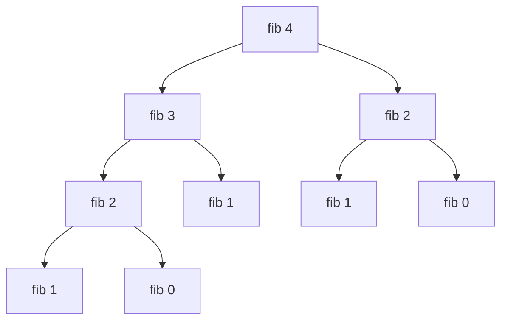

# Lecture 9-3

## Mutual and Multiple Recursion

### Mutual Recursion

Mutual recursion is when two functions call each other:

```haskell
even' 0 = True
even' n = odd' (n-1)

odd' 0 = False
odd' n = even' (n-1)
```

We have to make sure that:

* We terminate in a base case.
* We always make progress towards a base case.

Mutual recursion is a stylistic choice.

## Multiple Recursion

Multiple recursion is when a function makes more than one recursive call in the same recursive rule. This has been see in the `fib` function that we made. 

Multiple recursion **can** make your code slow as each call makes two additional threads growing the recursive tree exponentially. Additionally the same function is called multiple times with the same parameters.



### Faster `fib`

Create a **helper function** that computes the Fibonacci list:

```haskell
fast_fib_help 1 = [1,0]
fast_fib_help n = x + y : (x:y:xs)
	where (x:y:xs) = fast_fib_help (n-1)
```

This returns the first `n` Fibonacci numbers counting down to 0. To turn this into a more presentable list we can use another user facing function:

```haskell
fast_fib n = head (fast_fib_help n)
```

This function is not **multiply recursive** and is therefore must faster to compute.

## Exercises

1. ```haskell
	multipleThree 0 = True
	multipleThree x = two (n-1)
	
	one 0 = False
	one x = multipleThree (n-1)
	
	two 0 = False
	two x = one (n-1)
	```

1. ```haskell
	lucas 0 = 2
	lucas 1 = 1
	lucas n = lucas (n-1) + lucas (n-2)
	```