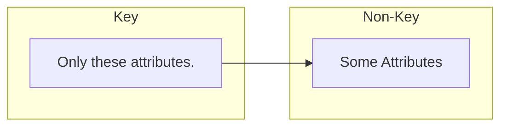
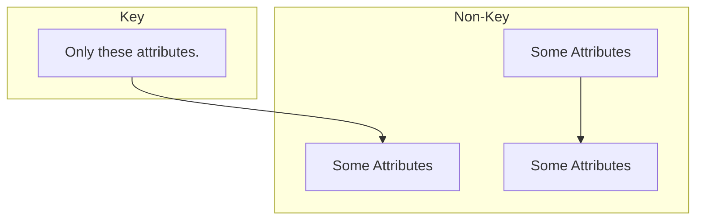
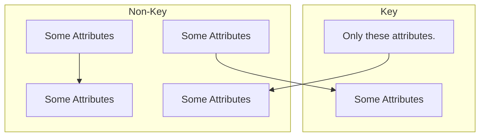
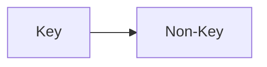

## A Graphic Guide to Normal Forms Bases on Functional Dependencies

Consider your typical relation:

$$\text{TypicalRelation={KeyAtt1, KeyAtt2,..., KeyAttN, NonKeyAtt1,..., NonkeyAttM}}$$

For the table you could see the following:

This is not in 2NF as the whole of the key should be used to point to some other attributes.
{:.info}

This is not in 3NF as attributes should depend on the key.
{:.info}

This is not in BCNF as there is a relation from a non-key attribute to a key attribute.
{:.info}

### Table in BCNF
A table that satisfies  all normal forms up to BCNF will look like the following:

* The whole key is need to determine all non-key attributes.
* There are no other dependencies.

## Normal Forms are Not Enough
When considered in isolation, NFs do not guarantee a good design. Important additional properties to check:

* Dependency Preservation Property
	* Each functional dependency is represented in some realisation after normalisation.
	* Desirable but can be sacrificed for other factors.
* Non-Additive Join Property
	* No spurious tuples are generated after normalisation.
	* Extremely critical.

Algorithms can be used to guarantee that a set of relations satisfies either or both of the properties.

For examples including the tables we have reviewed before, see [the slides]({{site.baseurl}}/assets/COMP107/Lectures/2020-12-11-1.pdf). There are also notes on functional dependency (relation cardinality) preservation.
{:.info}

### Dependency Preservation
Depending on how you split your tables, you can break dependencies. In order to not lose them dependencies should be a composite key of any dependants in a table.

View [slide 9]({{site.baseurl}}/assets/COMP107/Lectures/2020-12-11-1.pdf) for the full example.
{:.info}

### Non-Additive Join
This is about avoiding spurious tuples that are not in the original table when re-joining two related tables.

View [slide 10]({{site.baseurl}}/assets/COMP107/Lectures/2020-12-11-1.pdf) for the full example.
{:.info}

#### Testing for Non-Additive Join
We can use the **tableaux test** for non-additive join to find out whether it satisfies that property.

* Start from the universal relation and the set of functional dependencies.
	* This is the table with all the attributes and no relations.
* If the test succeeds, we can be sure all instances of the database will never generate spurious records.
* If the test fails, it gives the counter example we need.

#### Tableaux Test
This simulates what would happen if a report was created that joined all tables in the database. One would assume that only very few individual are such that their relationships can be trace through all tables.

If a join over all tables produces a potential infinite amount of such individuals, we would be in the presence of spurious records.

We would make a table like follows with one row for each table (relation):

| | Attribute 1 | Attribute 2 | ... | Attribute $n$ |
| --- | --- | --- | --- | --- |
| Relation 1 | | | | |
| Relation 2 | | | | |
| ... | | | | |
| Relation $m$ | | | | |

View [slide 15 onward]({{site.baseurl}}/assets/COMP107/Lectures/2020-12-11-1.pdf) for the full example.
{:.info}

##### Method

1. Prepare the table.
	* When filling in the universal table for the test; fill out each relation in turn and then fill in all the values around it.
1. Fill in each row with generic attributes ensuring consistency.
	*  When completing following relations use logical repetitions.
1. Apply the functional dependencies in turn.
	* This fills in some remaining dependencies.
	* You cannot assume a dependency given the dependant.
	
	The functional dependencies only represent constraints. If a relation doesn't have a constraint then is is not a functional dependency: All tuples with the same $x$ must have the same $y$ for $x\rightarrow y$.
	{:.info}

After these steps, if we manage to complete *a* row of values, we pass the test. If not, then it fails.

In a case where it fails you fill it will meaningful data, split it by the relations and then join it. This will show the spurious records.

If a table has no functional dependencies it fails the test immediately.
{:.error}

#### Fix Spurious Tables
You can add a bridge relation to tables that don't satisfy non-additive join.

This is a relation that contains the super-key of the whole database (the key of the universal relation).

* Add another table to the list of relations that contains all of the keys for the other relations.
* This will always create a full row in the table (that passes the test) but does introduce an extra table.
