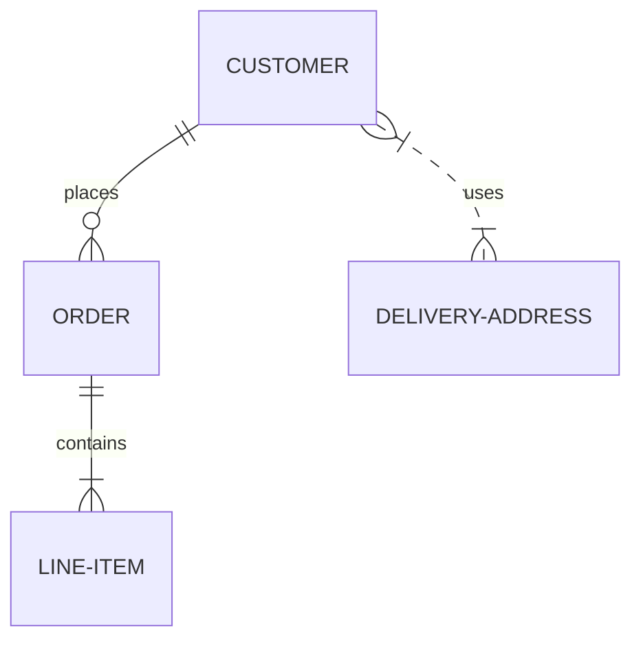

## How to Describe Data
The ER model describes data in terms of:

* Entities
	* A thing which can be distinctly identified
* Attributes
	* A property of an entity.
* Relationships
	* An association among entities.

Attempt a data description of a system you know well:

* Scoping which part of the system do you want to represent
* Write three sentences that are relevant to the system and depict them graphically.

Use the system of YouTube

The group made the following:

