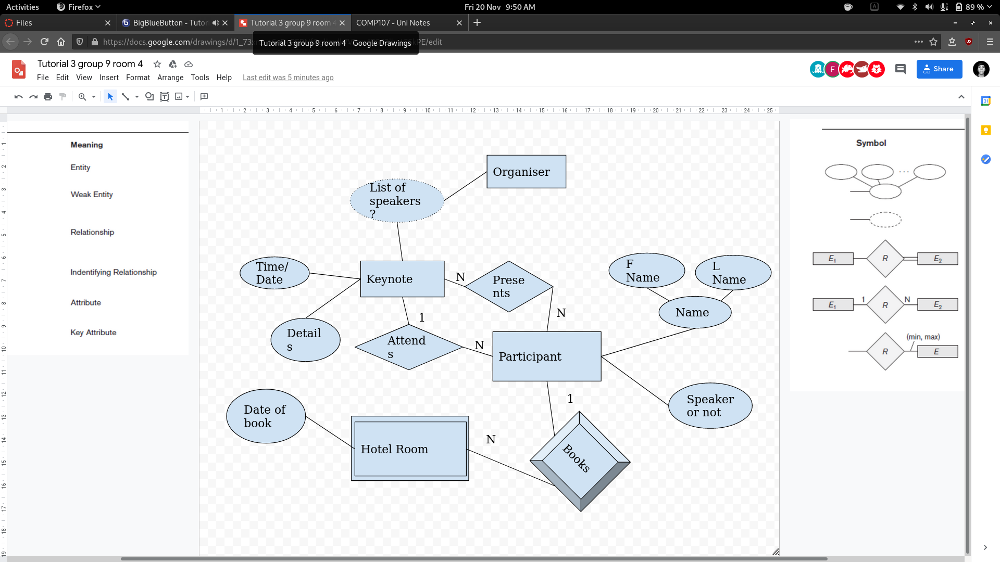

## Designing an ER Schema
You should identify basic components:

* Entity types, relationship types, attributes:
	* Key attributes.
	* Cardinality and participation constrains of relationships.
	* Different entity types. 
	
There are also weak entities such as tables or chairs. These simple objects don't need individual identification and should be a child of the strong entity.

The [lecture slides](.pdf) have a summary and examples of the ER diagram scheme.
{:.info}

## Evolutionary Data Modelling

Evolutionary data modelling is an approach that proceeds in an incremental manner:

* An initial slim model is created that satisfies some initial requirements.
* The model is then refines in a set of iterations adding details.

## Exercise
Draw an ER model to describe the data need by the conference planner app starting from users stories:

* 3 iterations with 8 minutes each.

### Task 1
1. As a speaker, I want to upload the details of my keynote.

1. As a speaker I want to know then my keynote is scheduled.

### Task 2
1. As a participant I want to register my attendance to a keynote.
1. As a participant I want to book a room in a hotel.

### Task 3
1. As an organiser, I want to know which conference participants are giving keynotes.

### Tutor Review
* Speaker or not is redundant as it is implied by the fact they are presenting or not.
* This is the same for the list of speakers. As it can be derived as a query
* The organiser doesn't need to be represented as they are just querying.

#### Final diagram after review:

