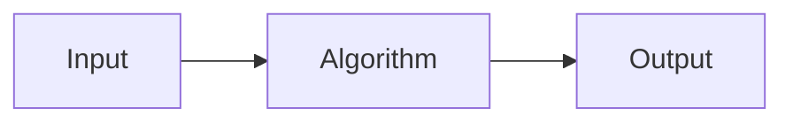

## Algorithms
An algorithm is a **precise and concise** set of instructions that guide you to solve a specific problem in a **finite** amount of time.



The differences between algorithms and programs are as follows:

* In algorithms the content is more important than the form.
* Algorithms are free from grammatical Rules.
*  Programs must follow syntax rules.
	* Form is important.

## Pseudo Code
This is a logical code that doesn't strictly follow the syntax of any individual programming language. They are useful for drafting algorithms.

Pseudo code uses a combination of english and code to make it more human readable.

### Control Flow
The following conventions for pseudo code are preferred:

```
if <condition> then
	<statement>
else
	<statement>
```

```
for <variable> <- <value1> to <value2> do
	<statement>
```

```
while <condition> do
	<statement>
```

#### Blocks
Block in control sequences should be laid out like so:

```
begin
	<statement1>
	<statement2>
	.
	.
	.
end
```

or:

```
{
	<statement1>
	<statement2>
	.
	.
	.
}
```

### Operations

* The `%` operator can be used in place of `mod`.

### Other Notes

The use of a boolean variable to mark a significant event is called a **flag variable**. You can use this to mark a condition that has been met.

It is recommended that you draw a **trace table** of all the values at each iteration to find logical errors in your algorithms. You can also use them to find out what an algorithm does.