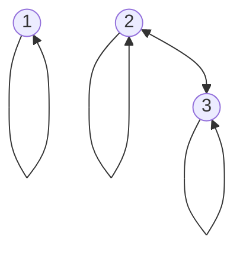

## Digraph Representation
In the directed graph representation, $R$ is:

* **Reflexive** if there is always an arrow from every vertex to itself.
* **Symmetric** if whenever there is an arrow from $x$ to $y$ there is also an arrow from $y$ to $x$.
* **Antisymmetric** if  whenever there is an arrow from $x$ to $y$ and $x\neq y$, then there is no arrow from $y$ to $x$.
* **Transitive** if whenever there is an arrow from $x$ to $y$ and from $y$ to $z$ there is also an arrow from $x$ to $z$.

### Example 1

* Reflective $\forall x:xRx$
* Symmetric $\forall x,y: xRy\Rightarrow yRx$
* Antisymmetric $\forall x,y:xRy,yRx\Rightarrow x=y$
* Transitive $\forall x,y,z:xRy,yRz\Rightarrow xRz$

Let $A=\{1,2,3\},R_1=\{(1,1),(2,2),(3,3),(2,3),(3,2)\}$

