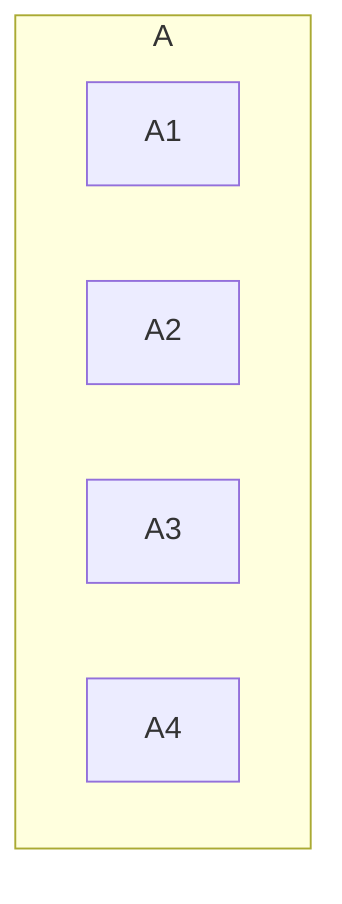

## Equivalence Relations
A binary relation $R$ on a set $A$ is called an equivalence relation if it is **reflective**, **transitive** and **symmetric**.

This is the same as $x=y$ in that $x$ has the same property as $y$.

### Example 1
The relation $R$ on the non-zero integers given by $xRy$ if $xy>0$.

This means that the relation is satisfied if $x$ and $y$ are both positive or both negative.
{:.info}

1. Reflexivity: $\forall x\in \Bbb{Z}-\{0\}$

	$x\times x=x^2$
1. Symmetry: $\forall x,y\in \Bbb{Z}-\{0\}\text{ if }x\times y>0\text{ then } y\times x =x\times y>0$
1. Transitivity: $\forall x,y,z\in \Bbb{Z}-\{0\}\text{ if } xRy\text{ and }yRz \text{ then } xRz$

	This is a statement which must be proved in order to be valid. See below.
	{:.warning}
	
	Suppose that $x,y,z$ are particular but arbitrarily chosen non-zero numbers such that $x\times y>0$ and $y\times z>0$.
	
	Case 1 - $y>0$
	
	$y>0\Rightarrow x>0,z>0\Rightarrow x\times z>0$
	
	Case 2 - $y<0$
	
	$y<0\Rightarrow x<0,z<0\Rightarrow x\times z >0$

### Example
Let $f:A\rightarrow B$ be a function. Define a relation $R$ on $A$ by:

$$a_1Ra_2\Leftrightarrow f(a_1)=f(a_2)$$

$A$ is a set of cars,  $B$ is the set of real numbers, and $f$ assigns to any car in $A$ its length. Then $a_1Ra_2$ if and only if $a_1$ and $a_2$ are of the same length.

In this case the length of the car is mapped to a real number. They could also be mapped to a word such as $\text{long}$.

## Partition of a Set
A partition of a set $A$ is a collection of non-empty subsets $A_1,\ldots A_n$ of $A$ satisfying:

* $A=A-1\cup A_2\cup\ldots\cup A_n$.
* $A_i\cap A_j=\emptyset$ for $i\neq j$.

The $A_i$ are called the blocks of the partition.

This set $A$ has four blocks and the four blocks cover every element in the set $A$.
{:.info}

This is the same as example 1 where the relation split the set of non-zero real numbers into two blocks of positive and negative numbers.

## Equivalence Class
The equivalence class $E_x$ of any $x\in A$ is defined by:

$$E_x=\{y\vert yRx\}$$

From the example before, the equivalence class of any positive integer is the class of positive integers and the equivalence class of any negative integer is the class of all negative integers.

## Connecting Partitions and Equivalence Relations
### Statement 1
Let $R$ be an equivalence relation on a non-empty set $A$. Then the equivalence classes $\{E_x\vert x\in A\}$ form a partition of $A$.

#### Proof (Optional)
The proof is in four parts:

1. We show that the equivalence classes $E_x=\{y\vert yRx\},x\in A$, are non-empty subsets of $A$: by definition, each $E_x$ is a subset of $A$. Since $R$ is reflexive, $xRx$. Therefore $x\in E_x$ and so $E_x$ is non-empty.

	This means that no equivalence class is not empty. This is because in a reflexive relation there are links to every element.
	{:.info}
1. We show that $A$ is the union of equivalence classes $E_x,x\in A$: We know that $E_x\subseteq A$, for all $E_x, x\in A$. Then $x\in E_x$. So, $A$ is a subset of the union of the equivalence classes.

	This means that the union of all the classes forms the full set and that they don't share any elements.
	{:.info}
1. We show that if $xRy$ then $E_x=E_y$: Suppose that $xRy$ and let $z\in E_x$. Then $zRx$ and $xRy$. Since $R$ is a **transitive** relation, $zRy$. Therefore, $z\in E_y$. We have shown that $E_x\subseteq E_y$. An analogous argument shows that $E_y\subseteq E_x$. So, $E_x=E_y$.
1. We show that any two distinct equivalence classes are disjoint: To this end we show that if two equivalence classes are not disjoint then they are identical. Suppose $E_x\cup E_y\neq \emptyset$. Take a $z\in E_x\cap E_y$. Then, $zRx$ and $zRy$. Since $R$ is symmetric, $xRZ$ and $zRy$. Bu then, by transitivity of $R$, $xRy$. Therefore, by 3., $E_x=E_y$

	These two mean that there can be no different partitions that overlap but don't contain the same items. By this they must be the same equivalence class or be disjoint (have no elements in common).
	{:.info}

### Statement 2
Suppose that $A_1,\ldots,A_n$ is a partition of $A$. Define a relation $R$ on $A$ by setting: $xRy$ of an only if there exists $i$ such that $1\leq i\leq n$ and $x,y\in  A_i$. Then $R$ is an equivalence relation.

#### Proof (Optional)
* Reflexivity: if $x\in A$, then $x\in A_i$ for some $i$. Therefore $xRx$.
* Transitivity: if $xRy$ and $yRz$, then there exists $A_i$ and $A_j$ such that $x,y\in A_i$ and $y,z\in A_j$. $y\in A_i\cap A_j$ implies $i=j$. Therefore $x,z\in A_i$ which implies $xRz$.
* Symmetry: if $xRy$, then there exist $A_i$ such that $x,y\in A_i$. Therefore $yRx$.

### Application - Rational Numbers
From what we have learned you can define the concept of rational numbers based on the set of integers.

$r$ is rational if $r=\frac{k}{k}$, where $k,l$ are integers and $l\neq 0$.

Evidently, $\frac{1}{2}=\frac{2}{4}=\frac{3}{6}=\ldots$

Consider the set $A=\{(a,b)\in\Bbb{Z\times Z}\vert b\neq0\}$ and relation $R$ on $A$ defined as:

$$(a,b)R(c,d)\Leftrightarrow ad=bc$$

* $R$ is an equivalence relation on$A$ and the set of all equivalence classes of.
* $R$ is the set of rationals

In other words:

$$\Bbb{Q}=\{E_x\vert x\in A\}$$