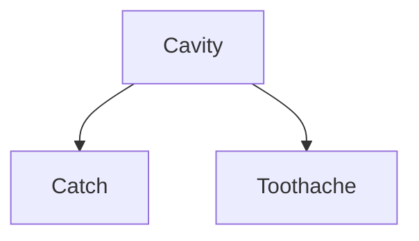
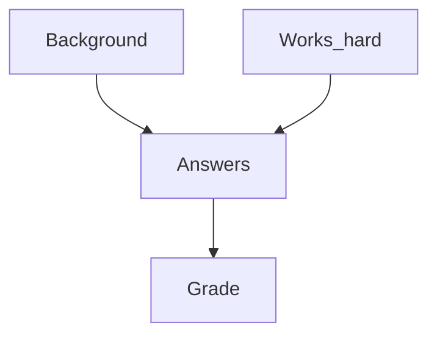
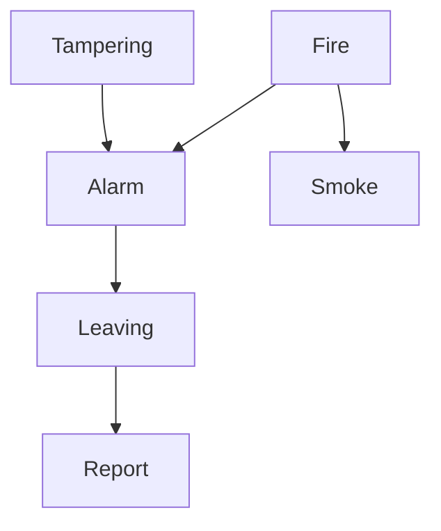

## Conditional Independence
Random variable $G,F$ are conditionally independent given $H_1,\ldots,H_n$ if:

$$
\begin{aligned}
\mathbf{P} (G,F\vert H_1,\ldots,H_n)=&\mathbf{P}(G\vert H_1,\ldots,H_n)\\
\times& \mathbf{P}(F\vert H_1,\ldots,H_n)
\end{aligned}$$

or, equivalently:

$$\mathbf{P} (G\vert F, H_1,\ldots,H_n)=\mathbf{P}(G\vert H_1,\ldots,H_n)$$

This is using the multiplication rule.
{:.info}

### Example - Dentistry
In the dentist domain it seems reasonable to assert conditional independence of the variables $\text{Toothache}$ and $\text{Catch}$, given $\text{Cavity}$:

$$
\begin{aligned}
&\mathbf{P}(\text{Toothache,Catch}\vert \text{Cavity})\\
&=\mathbf{P}(\text{Toothache}\vert \text{Cavity})\mathbf{P}(\text{Catch}\vert\text{Cavity})
\end{aligned}
$$

or, equivalently:

$$
\begin{aligned}
&\mathbf{P}(\text{Toothache}\vert \text{Cavity})\\
&=\mathbf{P}(\text{Toothache}\vert\text{Catch, Cavity})
\end{aligned}
$$

This means that the cavity causes the toothache and if you have a cavity it is more likely that the steel probe catches. The lack of the arrow between toothache and catch mean that given that they have a cavity there is no relation between catching and the toothache.
{:.info}

Using conditional independence of $\text{Catch}$ and $\text{Toothache}$ given $\text{Cavity}$ we can compute the joint probability distribution:

$$\mathbf{P}(\text{Toothache, Catch, Cavity})$$

using **only** the probability distributions:

$$
\begin{aligned}
&\mathbf{P}(\text{Toothache}\vert \text{Cavity}),\\
&\mathbf{P}(\text{Catch}\vert\text{Cavity}),\\
&\mathbf{P}(\text{Cavity})
\end{aligned}
$$

The computation is as follows (using first multiplication rule and the conditional independence):

$$
\begin{aligned}
&\mathbf{P}(\text{Toothache, Catch, Cavity})\\
=& \mathbf{P}(\text{Toothache,Catch}\vert \text{Cavity})\times \mathbf{P}(\text{Cavity})\\
=& \mathbf{P}(\text{Toothache}\vert \text{Cavity})\times \mathbf{P}(\text{Catch}\vert\text{Cavity})\\
&\times\mathbf{P}(\text{Cavity})
\end{aligned}
$$

The number of probabilities needed is reduces to 5. Moreover, these probabilities can often be learned form data.

## Towards Belief Networks
Conditional independence can be used to give concise representations of many domains.

A **belief network** (Bayesian network) is a graphical probabilistic model of domain in which nodes represent random variable and arc probabilistic dependence (often causality).

Informally, if there is an arc from a random variable $F$ to another random variable $G$ then $G$ depends on $F$. $F$ is called a parent of $G$. It is assumed that there are not cycles and that any random variable $G$ is conditionally independent of any non-parent variable $G'$ given the parents of $G$ if $G'$ cannot be reached by a sequence of arcs from $G$. For example, the graph above.

The full joint probability distribution is then given as:

$$\prod_{F\text{ in the network}} \mathbf{P}(F\vert \text{parents}(F))$$

The $\prod$ symbol means "the product of".
{:.info}

In the example:

$$
\begin{aligned}
\mathbf{P}(\text{Toothache}\vert \text{Cavity})&\times \mathbf{P}(\text{Catch}\vert\text{Cavity})\\
&\times\mathbf{P}(\text{Cavity})
\end{aligned}
$$

As cavity has no parents then we can just take it's probability.
{:.info}

### Example - Student Exam Domain
Variables: $\text{Grade, Answers, Background, Works\_hard}$

Then is seems reasonable to assume that:

* $\text{Works\_hard}$ and $\text{Background}$ are independent.
* $\text{Grade}$ and $\text{Works\_hard}$ are independent given $\text{Answers}$ and $\text{Grade}$.
* $\text{Background}$ are independent given $\text{Answers}$.

We represent this modelling of the domain using the Belief Network:

### Example - Fire Alarm Domain
The fire alarm domain can be represented in the following graph:

