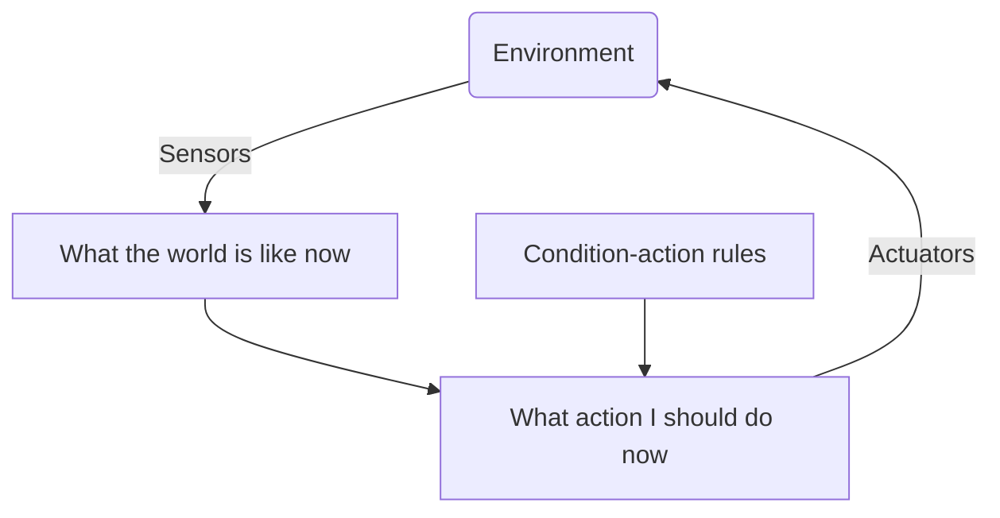
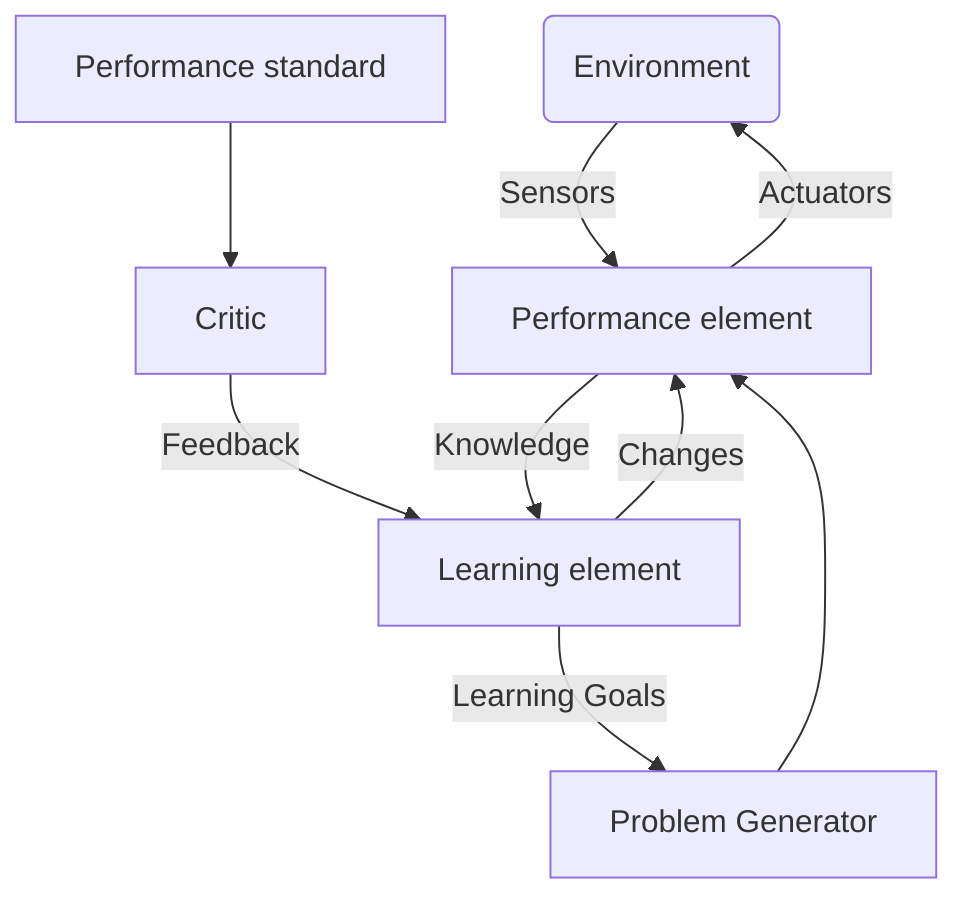

# Classification of Intelligent Agents

Intelligent agents are classified depending on how they map their precepts to their actions. They can be classed under:

* Simple reflex agents
	* Select actions to execute based upon the current percept
	* Don't take the percept history into account.
	* Very simple IFTTT actions.
	* Very simple to implement but have limited intelligence.
	* They have no memory.

@figure

@/

* Model-based reflex agents
	* Maintain an internal state that depends upon the percept history - memory.
	* Helps deal with partial observability.
	* Knows how the world evolves and how its actions affect the world.

@figure
```mermaid
graph TB
    A(Environment)--> |Sensors| B
    B[What the world is like now] --> C
    C[What action I should do now]--> |Actuators| A
    D[Condition-action rules]-->C
    E-->B
    B.->E(State)
    F(How the world evolves)-->B
    G(What my actions do)-->B
```
@/

* Goal-based agents
	* Select appropriate actions to achieve desirable state of the environment.
	* Knowledge of the current state does not automatically mean that the agent knows what to do.
	* It will have to plan what to do over a long sequence of actions.

@figure
```mermaid
graph TB
    A(Environment)  --> |Sensors| B
    B[What the world is like now] --> H
    H[What it will be like if I do action A] --> C
    C[What action I should do now]--> |Actuators| A
    D[Condition-action rules]-->C
    B.->E(State)
    E-->B
    F(How the world evolves)-->B
    F --> H
    G(What my actions do)-->B
    G --> H
```
@/

* Utility-based agents
	* Make use of a utility function to compare the **desirability** of different states that result from actions.
	* Many actions may satisfy the goal but which one is the most desirable?
	* Utility function maps a state, or sequence of states, onto a number to give the degree of **usefulness** of the state to the agents.
	* Agent maximises the value of its utility function.

@figure
```mermaid
graph TB
    A(Environment)--> |Sensors| B
    B[What the world is like now] --> H
    H[What it will be like if I do action A] --> I
    I[How happy I will be in such a state] --> C
    J(Utility)-->I
    C[What action I should do now]--> |Actuators| A
    D[Condition-action rules]-->C
    B.->E(State)
    E-->B
    F(How the world evolves)-->B
    F --> H
    G(What my actions do)-->B
    G --> H
```
@/

* Learning agents
	* Learning agents find ways of maximising their utility function based on previous experience
	* The performance element is the same choice mechanism from the previous agents. This is now informed by the learning element.
	* The performance standard informs the learning element how well it's actions have worked.

@figure

@/
