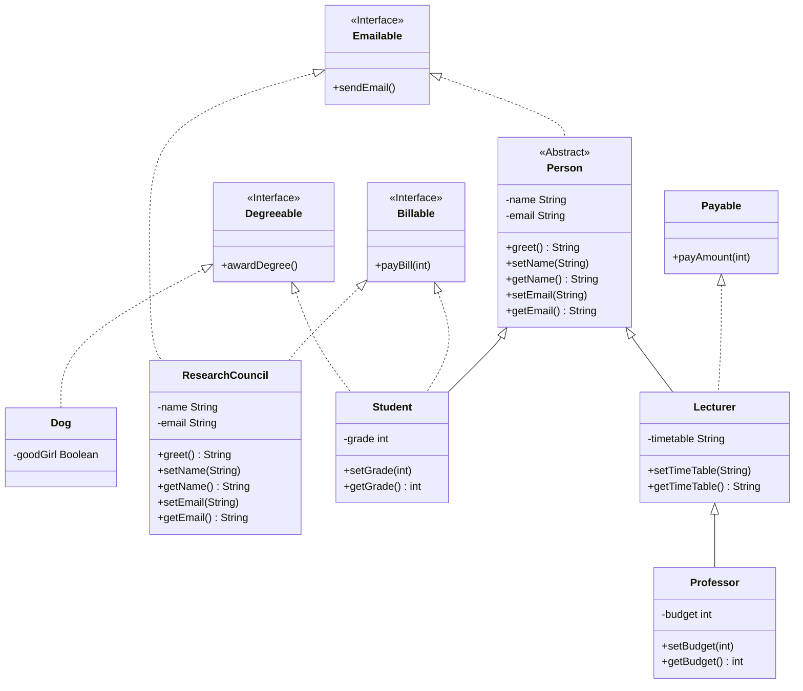

UML diagrams including **abstract** classes and **interfaces** can be drawn in the following way:

```mermaid
classDiagram
Degreeable <|.. Dog
Emailable <|.. ResearchCouncil
Billable <|.. ResearchCouncil
Degreeable <|.. Student
Billable <|.. Student
Emailable <|.. Person
Person <|-- Lecturer
Payable <|.. Lecturer
Person <|-- Student
Lecturer <|-- Professor
class Person{
    <<Abstract>>
    -name String
    -email String
    +greet() String
    +setName(String)
    +getName() String
    +setEmail(String)
    +getEmail() String
}
class Student{
    -grade int
    +setGrade(int)
    +getGrade() int
}
class Lecturer{
    -timetable String
    +setTimeTable(String)
    +getTimeTable() String
}
class Professor{
    -budget int
    +setBudget(int)
    +getBudget() int
}
class Degreeable{
    <<Interface>>
    +awardDegree()
}
class Billable{
    <<Interface>>
    +payBill(int)
}
class Emailable{
    <<Interface>>
    +sendEmail()
}
class Payable{
    +payAmount(int)
}
class Dog{
    -goodGirl Boolean
}
class ResearchCouncil{
    -name String
    -email String
    +greet() String
    +setName(String)
    +getName() String
    +setEmail(String)
    +getEmail() String
}
```