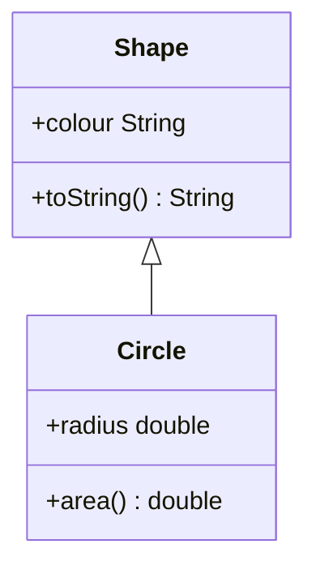
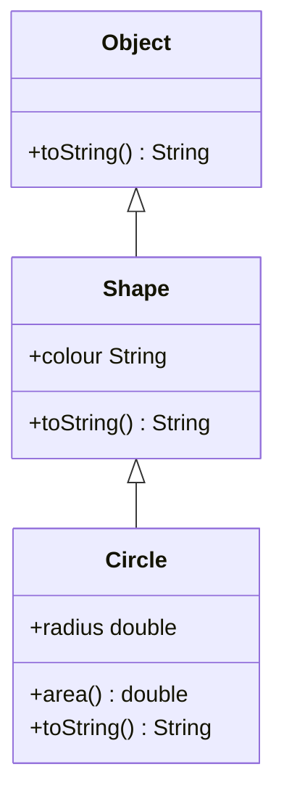

## Overriding a Superclass Method
A subclass inherits the `public` or `protected` attributes and methods in its superclass.

It can **override** an inherited method (identified by its signature) by re-implementing an inherited method.

### Shapes Example



Consider that the `Shape.toString()` function returns a statement like: "I am a `colour` shape."

You may want to re-implement this for the subclass to be more specific.

#### Example in Java
The following code would emulate the behaviour above:

```java
public class Shape {
	public String colour;
	public String toString() {
		return "I'm a " + colour + " shape!";
	}
}
```

```java
public class Circle extends Shape {
	public double radius;
	public String toString() {
		return "I'm a " + colour + " circle!";
	}
	// Show print functions
	public static void main(String[] args) {
		Shape s = new Shape();
		s.colour = "red";
		System.out.println(s.toString());
		Circle c = new Circle();
		c.colour = "red";
		System.out.println(c.toString());
	}
}
```

#### `Object` Class
As all classes are subclasses of the `Object` class we can draw the following hierarchy:



The `Object` class has a `toString()` method of its own so we have also overwritten it using `Shape`. This is the reason why you can always print a given object by calling:

```java
className.toString();
```

### Overriding vs. Overloading 

* **Overriding** - Involves providing several methods with the same name and parameter list, but declared in classes which are in a subclass/superclass relationship.
* **Overloading** - Involves providing several methods with the same name, but different parameter lists.