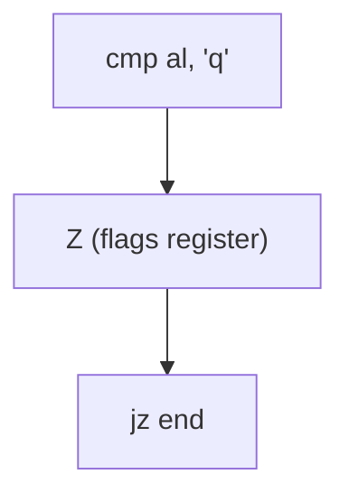

## The Flags Resgister
We often want to query the effect of a previous instruction. The status of an operation is recorded in the flags register.

It contains these flags and others:

* S - Sign
	* Indicates whether result is +/-.
* Z - Zero
	* Indicates if result is zero or not.
* C - Carry
	* Indicates an arithmetic carry.
* O - Overflow
	* Arithmetic overflow error.
	
We can use these flags in conjunction with jump instructions to control program flow.

## Jump Instructions
The simplest form is the **unconditional jump**. Is has the syntax:

```
JMP <address of the target instruction>
```

The address of the target instruction is usually given as a **label**.

### Example

```
start: ...
	...
	jmp continue	; jump forwards
	...
	...
	jmp start 	; jump backwards
	...
	...
continue:
```

Jumping is unrestricted, so programmers must take care to avoid spaghetti code.
{:.info}

### Conditional Jumps
Conditional jumps make the jump only if a specified condition holds.

If the condition is false, execution "falls through" to the next instruction.

#### Jumps that Test Flags

| Instruction | Jumps if | Value |
| :-: | :-- | :-: |
| JC | Carry flag is set | 1 |
| JNC | Carry flag is clear | 0 |
| **JZ** | Zero flag is set | 1 |
| **JNZ** | Zero flag is clear | 0 |
| JS | Sign flag is set | 1 |
| JNS | Sign flag is not set | 0 |
| JO | Overflow flag is set | 1 |
| JNO | Overflow flag is not set | 0 |

#### Example

```java
num = num - 10;
if (num == 0) {
	num = 100;
}
```

The prior code would look like this in assembly:

```
	mov eax, num
	sub eax, 10
	jnz store
	mov eax, 100
store:
	mov num, eax
```

You can see that we should test if not zero in the assembly code such that the body of the `if` is executed if the branch doesn't take place.
{:.info}

## Comparing Values
The `cmp` instruction is the most common way of comparing two values, prior to a conditional jump.

Internally, it subtract one value from the other, without altering the operands. 

It does modify the status flags.
{:.info}

Hence if `eax` and `ebx` contain the same values, then:

```
cmp eax, ebx
```

will set the `Z` flag.

### Example
Suppose our program reads a single letter command from the user into the `al` register.

The command `q` is used to quit the program.



### Other Conditional Jumps
These jumps can be used in combination with the `cmp` instruction.

| Instruction | Jumps if (after using `cmp`) |
| :-: | :-- |
| JE | The first operand (in `cmp`) is **e**qual to the second operand. |
| JNE | The first and second operands are **n**ot **e**qual. |
| JG/JNLE | First operand is **g**reater. |
| JLE/JNG | First operand is **l**ess or **e**qual. |
| JL/JNGE | First operand is **l**ess. |
| JGE/JNL | First operand is **g**reater or **e**qual. |

## `if` Statements

```java
if (c > 0)
	pos = pos + c;
else
	neg = neg + c;
```

This will convert to the following assembly:

```
	mov eax, c
	cmp eax, 0 	; compare c to 0
	jg positive	; jump to positive if positive
negative:	; else negative
	add neg, eax
	jmp endif ; jump over positive
positive:
	add pos, eax
endif:
	...
```