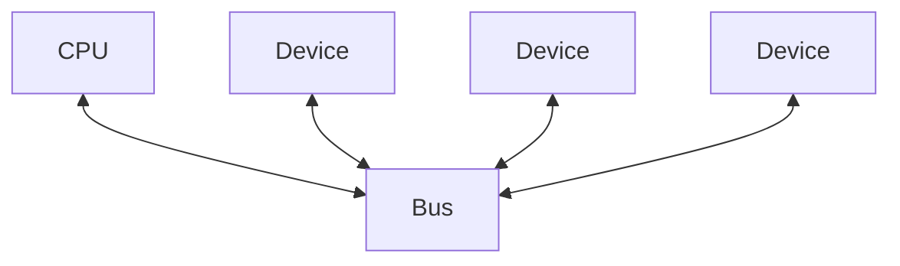
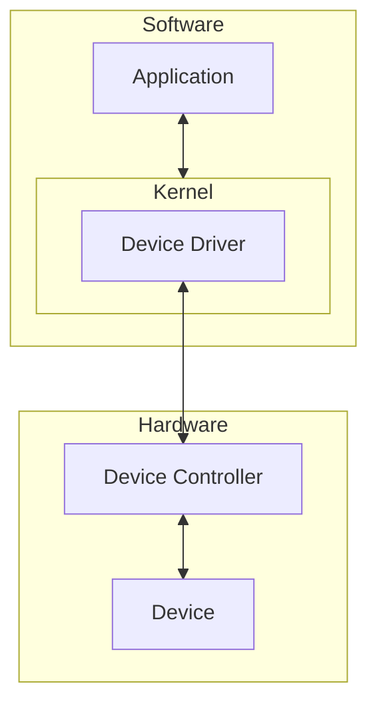
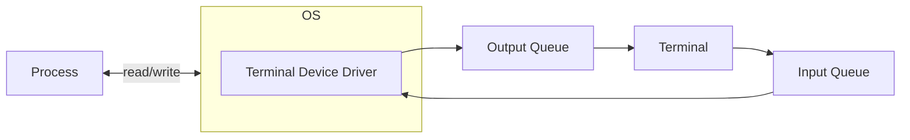

## Devices
Peripheral devices connect to **ports** on the computer.

Data and commands to/from the devices may travel along a shared set of wires called a **bus**:

* Devices ignore messages not intended for them.
* Problem of **bus contention**.

## Communication
Devices usually have several registers:

* Status register
	* Indicated busy/ready.
* Command/Control register
	* To pass commands to device.
* Data register
	* To send/receive data.
	
CPU may have special I/O instructions to alter/inspect device registers:

* Very specialised applications.

Often registers are mapped onto memory locations:

* Writing to location `100` might send a command to a device.
* Makes I/O easier because we treat it just the same as writing to memory.
* Need to protect these memory locations from malicious use or corruption.

## I/O Handling

* The kernel talks to the device driver as a result of system calls.
* The device driver translates high-level abstract system calls into signals that can be recognised by the device.

### Application I/O Interface
I/O devices can be categorised by their behaviours into generic classes:

* Each general type is accessed through an interface, which is a standard set of functions (though system calls may vary between OSs).

Device driver layer hides differences among I/O controllers from the kernel.

Devices vary on many dimensions:

* Character-stream vs. block.
* Sequential vs. random access.
* Sharable vs. dedicated.
	* Multiple vs. single process.
* Speed of operation.
* Read-write, read only, or write only.

## Device Handling
Device driver converts system calls to low-level commands to control the device.

* It may have to be installed for a new device.
* Treated as privileged code by the OS for kernel integration.
* Poorly written drivers may lead to system instability or security issues.

Device controller converts commands to electronic signals operating the hardware.

Application interface:

* At the application level, we want to treat devices as if they were files/streams.
* Accessing a special file activates the device driver.
* System call `ioctl()` can be used to pass arbitrary commands to the device driver.
	* This bypasses its file.
	
### Example - Unix Terminal

* Characters typed at keyboard are entered into input queue by device driver.
* To echo, driver copies input queue to output queue.
* Some characters require further processing by device driver:
	* Backspace removes an item from the input queue.
* When read request is made, pass contents of input queue to process.