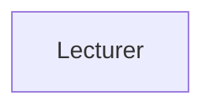
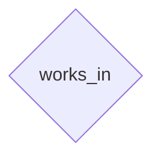
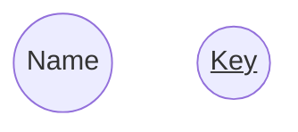
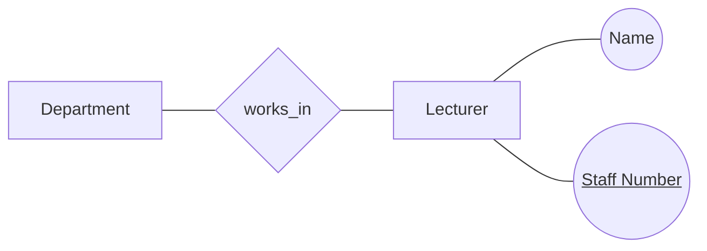
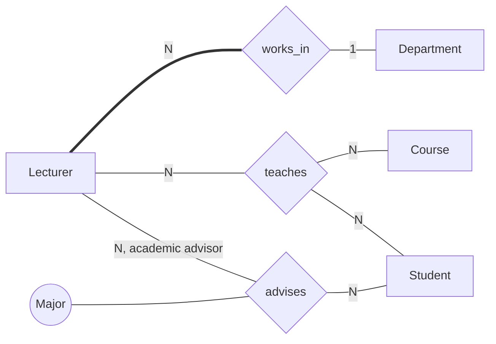

The entity relationship model is used to express the conceptual schema of a database. It was originally proposed in 1976 as a means to unify the network and relational DB models. 

Many theoretical extensions and practical applications have been developed including the **Enhanced Entity Relationship (EER)** model.

It is simple enough to learn and understand the basic concepts and powerful enough to be used in the development of complex applications.

Conceptual designs using the ER model are called **ER Schemas**

## ER Model Components
The ER model describes data in terms of three primitive notions.

### Entities
* An entity is a thing, which can be distinctly identified.
	
### Attributes
* A property of an entity.
* They are common properties that are shared by all instances of the entity type.


#### Complexity of Attributes
* Complex attributes have structure.
	* Dates
	* Addresses
* Simple attributes only have one component.

#### Cardinality 
Some attributes may have more than one value. If this is the case then you can say that a particular value has a cardinality \#92;(>0\#92;).

#### Primitiveness
A primitive attribute is any attribute which will be stored as data in the system.

A non-primitive, or derived attribute, can be calculated from other attributes.

* In some cases it is important that both attributes are indicated on the model
	* We should indicate which ones are redundant so that they can be derived.

### Relationships
* An association among entities.

#### Degree of Relationships
A relationship has a degree that is the number of participating entity types:

* Binary relationship (degree two).
	* A **person** owns a **car**.
* Ternary relationships (degree three).
	* A **lecturer** teaches a **course** to a **student**.
	
#### Attributes of Relationships
Relationships can have attributes in the case that the attribute is not of an entity but when it is related to the relationship.
	
* In the relationship type, "person owns a car" the attribute `date of purchase` is not an attribute of a person and is not an attribute of the car, it is an attribute of the ownership.

#### Structural Constrains on Relationships
Relationship constraints regulate the possible combinations of entities that can participate in a relationship:

* We can constrain the number of entities that can participate.
* We can put a constraint on whether some entities must participate.

##### Relationship Participation
A participation constraint specifies whether an entity must be in the given relationship.

* A **total participation constraint**, indicates that each instance of an entity must be in that relationship.
	* A programme must belong to a department.
* A **partial participation constraint** specifies that there may exist an entity which does not participate in the relationship.
	* Not all lecturers supervise students.

#### Cardinality of Relationships
* One to One
	* One department only has one head.
* One to Many
	* Each team can have many players but one player can only play for one team.
* Many to Many
	* A student can be registered for many courses and a course will have may students.

## ER Diagram Basics
Entity types are represented as boxes:



Relationship types are represented as diamonds connected with each participating entity type. The relationship must have a name.



Attributes are shown as ovals connected to the relevant entity or relation type. In addition key attributes are underlined.

* The key attribute should only be underlined if it arises naturally. If not there should be a key put in later in implementation.



This will come together to form the following diagram:



### ER Diagram Attributes
* A simple primitive attribute is represented as an oval:
	
	```mermaid
	graph TD
	d((Date of Birth))
	t((Tax Code))
	```
* Complex attributes can have their own structure made of simple attributes:
	
	```mermaid
	graph BT
	n((Name))
	n --- f((First Name))
	n --- m((Middle Name))
	n --- l((Last Name))
	```
* A multi-valued attribute is a double oval:

	```mermaid
	graph TD
	e(("(E-Mail Address)"))
    ```
* A derived attribute is a dotted oval:
	
	```mermaid
	graph TD
	a((Age))
	style a stroke-dasharray: 2 4
	```
	
### ER Diagram Relationships
* The degree of a relationship type is simply the number of entity types it connects.
* Binary relationships between two entities.
* Ternary relationships among three entities.
* If entities participate to several relationships, a *role* may be added to some edges for clarity.
* The cardinality is represented on the connecting lines (an \#92;(N\#92;) represents the many side.
	* One to many (works_in)
	* Many to many (teaches, advises)
* Total participation is represented by a double line. (I have used thick)
	* A lecturer must work in a Dept.
* Relationships can have attributes.
	* A student may have different advisors for different majors.


