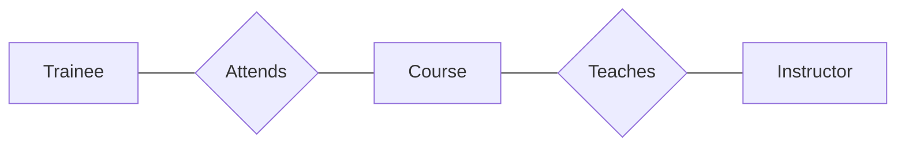
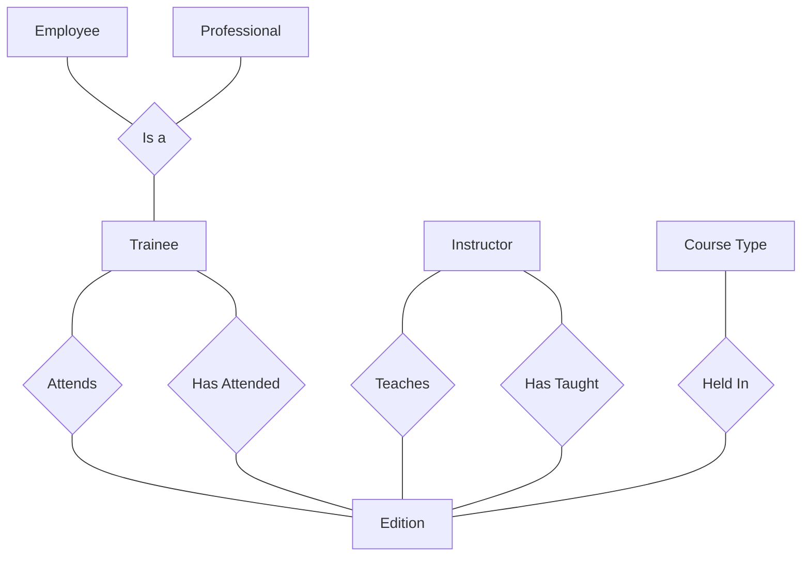
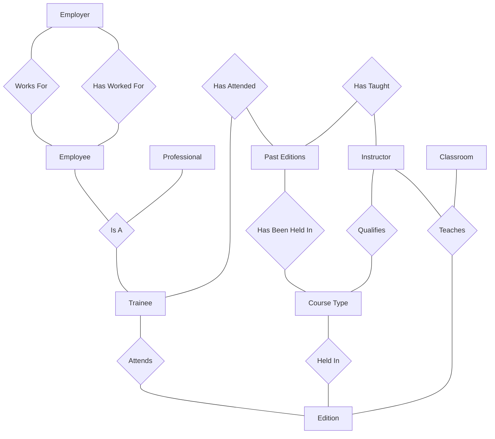
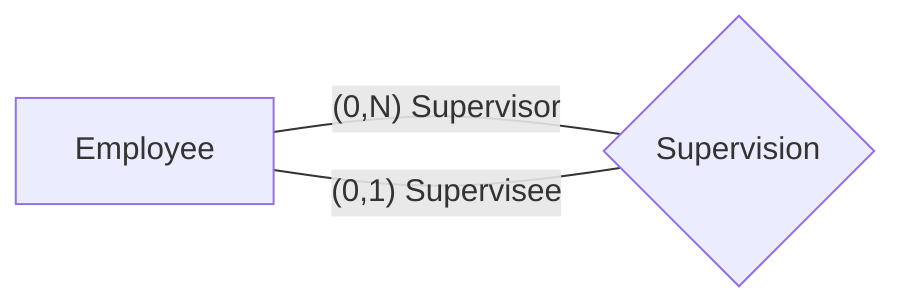

This type of modelling is inspired by agile principles.

## Designing an ER Schema
You should identify the basic components:

* Entity types.
* Relationship types.
* Attributes
* And for each of these components:
	* Key attributes (unique for each identity).
	* Cardinality and participation constraints of relationships.
	* Different entity types.
	
## Strategies to ER Design
* Top-down
	* Start with a schema containing high-level abstractions an apply successive top-down refinements.
* Bottom-up
	* Start with a schema containing basic abstractions then proceed by combining and adding to these.
* Inside-out
	* Start from a central set of concepts, that are most evident and spread outwards,  by considering new concepts in the vicinity of existing ones.

## Evolutionary Data Modelling
This is an approach that proceeds in an incremental manner.

* An initial **slim** model is created that satisfies some initial requirements.
* The model is then refines in a set of iterations, adding details.

At each iteration a database can be built with a set of functionalities, queries, interface...

* We will ignore this and only discuss data modelling.

### Agile?
Agile data modelling is evolutionary data modelling done in a collaborative manner.

Agile is a set of principles, not a specific technique.
{:.info}

You can decide whether you want to apply evolutionary modelling in a highly collaborative setting or in a traditional development setting.

### User Stories
* Primary tolls of agile programming strategies.
* They are a very high level and very concise statement of a requirement.
* Much much smaller than a use case.

#### Example
Students can only enrol in a module if it is included in their programme.

As they are so short you should have many in order to make the system.
{:.info}

#### Creating a Story Set
You can collect them informally or use a template. You should collect them systematically:

* Number them.
* Order them.
* Prioritise them.

#### Template
* As a (role) I want (something) to  that (benefit).
* Similar format to the tutorial:
	* As a..
	* I need/want/expect to...
	* So that...
	* When...
	* Because... (is the user constrained by any circumstances)
	
### Strategy
1. Collect, order and prioritise your user stories.
1. Decide how many iteration you want to make.
1. Decide which new stories you want to include in the design at each iteration.
1. Proceed to create an Entity Relationship model that represents those user stories. 

### General Criterial for Design
1. If a concept has a significant amount of properties it is an **entity**.
	* It's existence doesn't depend from other concepts.
1. If a concept has a simple structure or refers to another concept then it is an **attriute**.
1. If the requirements contain a verb or connector then it is a **relationship.**

### Example
Consider the following script:

```
1 We wish to create a system for a company that runs training courses.
2 For each course participant, identified by a code, we want to store the
3 national insurance number, surname, age, sex, place of birth,
4 employer’s name, address and telephone number, previous employers
5 (and period employed), the course attended and the final assessment
6 of each course. We need also to represent the seminars that each
7 participant is attending at present and, for each day, the places and
8 times the classes are held. Each course has a code and a title and any
9 course can be given any number of times. Each time a course is given,
10 we call it an “edition” of the course. For each edition, we represent
11 the start and end dates and the number of participants. If a trainee is
12 a self employed professional, we need to know his or her area of
13 expertise, and, if appropriate, his or her title. For somebody who
14 works for a company we store the level and position held. For each
15 instructor we will show surname, age, place of birth, the edition the
16 course is taught, those taught in the past and the courses the tutor is
17 qualified to teach. All the instructor’s telephone numbers are also
18 stored. An instructor can be permanently employed or freelance.
```

#### 1st Iteration - Two Stories
1. Trainees attend courses.
1. Instructors teach courses.



#### 2nd Iteration - Three Stories
1. Courses are held in editions.
1. Trainees can be self employed, professional or work for a company.
	* This could be as an attribute of the trainee or you could have it as two sub-entities.
1. We distinguish between current and past editions.



#### 3rd Iteration - Four Stories
1. Course are held in classrooms.
1. Instructors only teach courses for which they are qualified.
1. We archive past editions of courses keeping summary data.
1. We maintain data of trainees' employers.



This type of diagram may not result in the most efficient database. You may want to make changes from this conceptualisation when implementing. 

#### *Dodgy* Entities
Some entities such as trainee, professional and edition aren't true entities. They are a type of entity called a **weak entity**.

## Weak Entities
These are entities which cannot be identified in isolation. Instances are identified because they belong to specific entities from another entity type, known as **identifying owner**.

* The content of a lecture theatre - whiteboards, desks - cannot be typically identified directly. 
	* The lecture theatre is their identifying owner, so we can talk about: the front desk in the Ashton Lecture Theatre.

Weak entities are entities that have an owner.
{:.info}

* The relationship type that relates the weak entity to its owner is the weak entity's **identifying relationship**.
* Weak entity types might have a partial key, to distinguish one weak entity for other weak entities related to the same owner.

### Weak Entities v.s. Total Participation
A weak entity cannot exist in isolation, it must have an owner. This means that is is often confused with a total participation relationship.

#### Total Participation
* A lecturer *must* work for a department.
	* The lecturer is not a weak entity as they have a staff number and can be identified.

#### Weak Entity
* A desk *must* belong to a lecture theatre.
	* This is weak as we don't have a direct ID for the desk.

### ER Notation
* A weak entity is represented as a double box.
* The identifying relation is a double diamond.
* A partial key has a dotted underline.


View [the slides]({{site.baseurl}}/assets/COMP107/Lectures/2020-11-22-1.pdf) for the final diagram including this new notation. This also includes notation for multi-attributes. There is also a further example from the textbook.
{:.info}

#### Alternate Cardinality Notation.
Instead of using `1` or `N` to denote the cardinality of a relationship you can have finer control by stating the range of cardinalities allowed like so:


