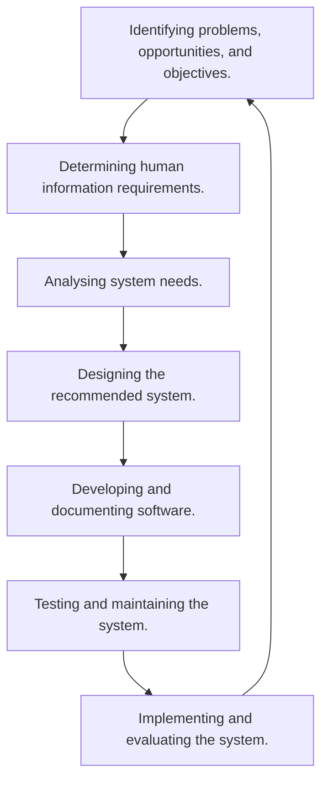

# System Analysis and Design
SAD seeks to understand what humans need to analyse data input or data flow systematically, process or transform data, store data, and output information in the context of a particular organisation or enterprise.

## Information - A Key Resource
* Information needs to be managed correctly.
* Managing computer-generated information differs from handling manually produced data.

## Need for SAD
* Installing a system without proper planning leads to great user dissatisfaction and frequently causes the system to fall into disuse.
* SAD provides structure to the analysis and design of information systems.

## System Analyst
### Role
The analyst must be able to work with people of all descriptions and be experience in working with computers. They have three primary roles:

* Consultant
	* Hired specifically to address information systems  issues.
* Supporting Expert
	* Not managing the project but giving professional advice for specific issues.
* Agent of Change
	* Most comprehensive role, introduction dramatic modifications to the organisation.
	
### Qualities
* Problem Solver
* Communicator
* Strong personal and professional ethics.
* Self-disciplined and self-motivated.

## Systems Development Life Cycle
This is a phased approach to solving business problems by using a specific cycle of analyst and user activities. 

* UX or user experience is a large factor in SAD and by taking a **human-centred approach** the project will be much more successful.

### Identifying Problems
#### Activity
* Interviewing user management.
* Summarising the knowledge obtained.
* Estimating the scope of the project.
* Documenting the results.

#### Output
* Feasibility report containing problem definition and objective summaries from which management can make a decision on whether to proceed with the proposed project.

### Determining Human Information Requirements
#### Activity
* Interviewing
* Sampling and investigating hard data.
* Questionnaires
* Observe decision makers' behaviour and environment.
* Prototyping
* Learn the who, what, where, when, how and why of they current system.

#### Output
* The analyst understands how users accomplish their work when interacting with a computer.
* Begin to know how to make the new system more useful and usable.
* Know the business functions.
* Have complete information on the:
	 * People
	 * Goals
	 * Data
	 * Procedure involved.
	 
### Analysing System Needs
#### Activity
* Create data flow, activity, or sequence diagrams.
* Complete the data dictionary.
* Analyse the structured decisions made.
* Prepare and present the system proposal.

#### Output
* Recommendation on what, if anything, should be done.

### Designing the Recommended System
#### Activity
* Design procedures for data entry.
* Design the human-computer interface.
* Design system controls.
* Design database and/or files.
* Design backup procedures.

#### Output
* Model of the actual system.

### Developing and Documenting Software
#### Activity
* System analyst working with programmers to develop any original software.
* Works with users to develop effective documentation.
* Programmers design, code, and remove syntactical errors from computer programs.
* Document software with help files, procedure manuals, and Web sites with FAQs.

#### Output
* Computer program and documentation.

### Testing and Maintaining the System
#### Activity
* Test the information system.
* System maintenance
* Maintenance documentation

#### Output
* Problems, if any.
* Updated programs
* Documentation

### Implementing and Evaluating the System
#### Activity
* Train users
* Analyst plans smooth conversion from old system to new system.
* Review and evaluate system.

#### Output
* Trained personnel 
* Installed system

## Scope of COMP107
COMP107 covers the first four steps of the systems development life cycle up to, and including designing the system.

* Assignment 1
	* Covers identifying problems and determining information requirements.
	* Come up with a real, complex problem and approach information gather in a way as authentic as possible, but using realistic tools.
* Assignment 2
	* Covers the data of the system.
	* Will develop a model of the data.