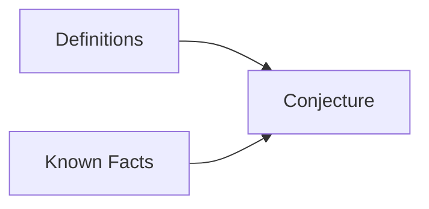

## Proving Existential Statements
An existential statement is a statement in the form: 
$$\exists x\ Q(x)$$
This means that there exists a value to which the function $$Q(x)$$ holds true. This may be under additional parameters.

The easiest way to prove this is to find an $$x$$ that makes the function $$Q(x)$$ true. Not all can be proved this way. 

### Examples
1. \$$\exists$$ an even integer $$n$$ that can be written in two ways as a sum of two prime numbers. 
	$$10=5+5=7+3$$
1. There $$\exists$$ integers $$m$$ and $$n$$ such that $$m>1$$, $$n>1$$ and $$\frac{1}{m} + \frac{1}{n}$$ is an integer.
	$$m=n=2$$
		Giving an example is a suitable proof.

## Proving Universal Statements
Generally proofs will require you to answer a universal statement rather than an existential one. an existential statement is of the form:
$$\forall x \text{ if } P(x) \text{ then } Q(x)$$
This means that for all of $$x$$ if one function is applied to $$x$$ another function in $$x$$ also holds true. For example:

If $$a$$ and $$b$$ are integers then $$6a^2b$$ is even.
{:.info}

In this statement the "$$a$$ and $$b$$ are integers" count for $$P(x)$$ and "$$6a^2b$$ is even" counts for $$Q(x)$$. 

$$6a^2b$$  

$$2(3a^2b)$$

By halving you are proving that the answer is even as it is a multiple of two.

### Proof by Exhaustion
For theorems examining a relatively small number of examples you can test each value to see if the statement holds true. That is proof by exhaustion.

#### Example
* Prove that $$(n+1)^3 \geq 3^n$$ if $$n$$ is a positive number.

As this theorem has such a small scope then each value can be tested to see if it is correct.

### Generalising from the Generic Particular
This method allows for using algebra and known rules to prove a statement generally.

#### Method
* Express the statement to be provided in the form $$\forall x,\text{ if } P(x) \text{ then } Q(x)$$
* Start the proof by supposing $$x$$ is a particular by arbitrarily chosen element for which the hypothesis $$P(x)$$ is true.
* Show that the conclusion $$Q(x)$$ is true by using definitions, previously established results, and the rules for logical inference.

This method brings together definitions and facts into a conjecture.
{:.info}

### Example
Prove that the sum of any two even integers is even.

1. (Assume that/Suppose that) $$m$$ and $$n$$ are particular but arbitrarily chosen even integers.
1. As we assumed that $$m$$ is an even integer, $$m = 2k$$ for some integer $$k$$. 
1. Likewise $$n$$ is an even integer, $$n = 2l$$, for some integer $$l$$
	* We cannot use the same letter again as $$k$$ has already been used
1. Then $$m+n=2k+2l=2(k+l)$$, which is even as $$k+l$$ is an integer.

The final step is called the conjecture as is aided by the previous steps to explain why the conjecture holds true.

### Disproving Universal Statement by Counterexample
To disprove a statement means to show that it is false. For example, for a statement such as:
$$\forall x \text{ if } P(x) \text{ then } Q(x)$$
You are saying that the opposite is true:
$$\exists x \text{ such that } P(x) \text{ and not } Q(x)$$

This means that you must give at least one example that disproves the universal statement.

#### Example
Is it true that for every positive integer $$n,n^2\geq 2n$$?

No as for $$n=1,\ n^2 = 1$$ and $$2n=2$$ which is greater than $$n^2$$
		
You can correct this by stipulating that for ever integer greater than one the statement holds true.
{:.info}
