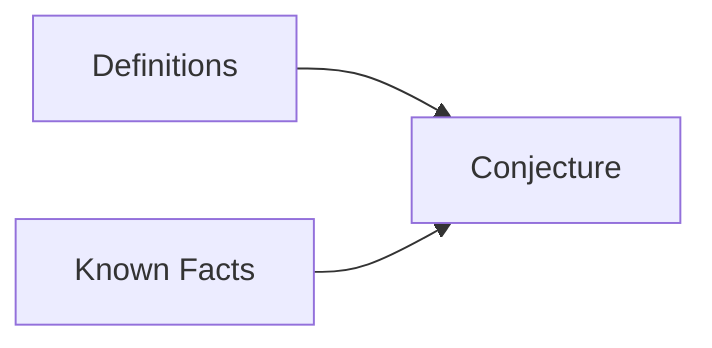

## Proving Existential Statements
An existential statement is a statement in the form: 
&#92;[&#92;exists x&#92; Q(x)&#92;]
This means that there exists a value to which the function &#92;(Q(x)&#92;) holds true. This may be under additional parameters.

The easiest way to prove this is to find an &#92;(x&#92;) that makes the function &#92;(Q(x)&#92;) true. Not all can be proved this way. 

### Examples
1. &#92;(&#92;exists&#92;) an even integer &#92;(n&#92;) that can be written in two ways as a sum of two prime numbers. 
	&#92;[10=5+5=7+3&#92;]
1. There &#92;(&#92;exists&#92;) integers &#92;(m&#92;) and &#92;(n&#92;) such that &#92;(m>1&#92;), &#92;(n>1&#92;) and &#92;(&#92;frac{1}{m} + &#92;frac{1}{n}&#92;) is an integer.
	&#92;[m=n=2&#92;]
		Giving an example is a suitable proof.

## Proving Universal Statements
Generally proofs will require you to answer a universal statement rather than an existential one. an existential statement is of the form:
&#92;[&#92;forall x &#92;text{ if } P(x) &#92;text{ then } Q(x)&#92;]
This means that for all of &#92;(x&#92;) if one function is applied to &#92;(x&#92;) another function in &#92;(x&#92;) also holds true. For example:

If &#92;(a&#92;) and &#92;(b&#92;) are integers then &#92;(6a^2b&#92;) is even.
{:.info}

In this statement the "&#92;(a&#92;) and &#92;(b&#92;) are integers" count for &#92;(P(x)&#92;) and "&#92;(6a^2b&#92;) is even" counts for &#92;(Q(x)&#92;). 

&#92;(6a^2b&#92;)  

&#92;(2(3a^2b)&#92;)

By halving you are proving that the answer is even as it is a multiple of two.

### Proof by Exhaustion
For theorems examining a relatively small number of examples you can test each value to see if the statement holds true. That is proof by exhaustion.

#### Example
* Prove that &#92;((n+1)^3 &#92;geq 3^n&#92;) if &#92;(n&#92;) is a positive number.

As this theorem has such a small scope then each value can be tested to see if it is correct.

### Generalising from the Generic Particular
This method allows for using algebra and known rules to prove a statement generally.

#### Method
* Express the statement to be provided in the form &#92;(&#92;forall x,&#92;text{ if } P(x) &#92;text{ then } Q(x)&#92;)
* Start the proof by supposing &#92;(x&#92;) is a particular by arbitrarily chosen element for which the hypothesis &#92;(P(x)&#92;) is true.
* Show that the conclusion &#92;(Q(x)&#92;) is true by using definitions, previously established results, and the rules for logical inference.

This method brings together definitions and facts into a conjecture.
{:.info}

### Example
Prove that the sum of any two even integers is even.

1. (Assume that/Suppose that) &#92;(m&#92;) and &#92;(n&#92;) are particular but arbitrarily chosen even integers.
1. As we assumed that &#92;(m&#92;) is an even integer, &#92;(m = 2k&#92;) for some integer &#92;(k&#92;). 
1. Likewise &#92;(n&#92;) is an even integer, &#92;(n = 2l&#92;), for some integer &#92;(l&#92;)
	* We cannot use the same letter again as &#92;(k&#92;) has already been used
1. Then &#92;(m+n=2k+2l=2(k+l)&#92;), which is even as &#92;(k+l&#92;) is an integer.

The final step is called the conjecture as is aided by the previous steps to explain why the conjecture holds true.

### Disproving Universal Statement by Counterexample
To disprove a statement means to show that it is false. For example, for a statement such as:
&#92;[&#92;forall x &#92;text{ if } P(x) &#92;text{ then } Q(x)&#92;]
You are saying that the opposite is true:
&#92;[&#92;exists x &#92;text{ such that } P(x) &#92;text{ and not } Q(x)&#92;]

This means that you must give at least one example that disproves the universal statement.

#### Example
Is it true that for every positive integer &#92;(n,n^2&#92;geq 2n&#92;)?

No as for &#92;(n=1,&#92; n^2 = 1&#92;) and &#92;(2n=2&#92;) which is greater than &#92;(n^2&#92;)
		
You can correct this by stipulating that for ever integer greater than one the statement holds true.
{:.info}
