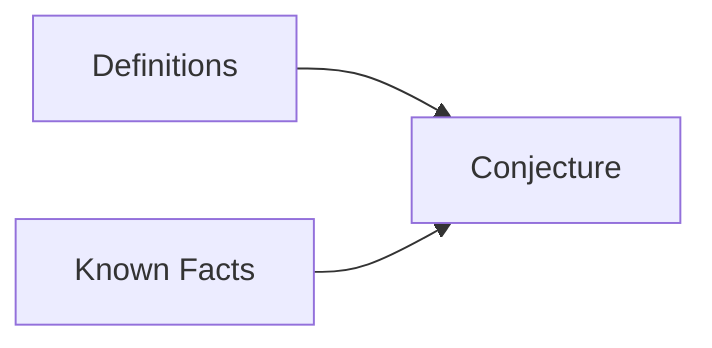

## Proving Existential Statements
An existential statement is a statement in the form: 
<pre>\[\exists x\ Q(x)\]</pre>
This means that there exists a value to which the function <pre>\(Q(x)\)</pre> holds true. This may be under additional parameters.

The easiest way to prove this is to find an <pre>\(x\)</pre> that makes the function <pre>\(Q(x)\)</pre> true. Not all can be proved this way. 

### Examples
1. <pre>\(\exists\)</pre> an even integer <pre>\(n\)</pre> that can be written in two ways as a sum of two prime numbers. 
	<pre>\[10=5+5=7+3\]</pre>
1. There <pre>\(\exists\)</pre> integers <pre>\(m\)</pre> and <pre>\(n\)</pre> such that <pre>\(m>1\)</pre>, <pre>\(n>1\)</pre> and <pre>\(\frac{1}{m} + \frac{1}{n}\)</pre> is an integer.
	<pre>\[m=n=2\]</pre>
		Giving an example is a suitable proof.

## Proving Universal Statements
Generally proofs will require you to answer a universal statement rather than an existential one. an existential statement is of the form:
<pre>\[\forall x \text{ if } P(x) \text{ then } Q(x)\]</pre>
This means that for all of <pre>\(x\)</pre> if one function is applied to <pre>\(x\)</pre> another function in <pre>\(x\)</pre> also holds true. For example:

If <pre>\(a\)</pre> and <pre>\(b\)</pre> are integers then <pre>\(6a^2b\)</pre> is even.
{:.info}

In this statement the "<pre>\(a\)</pre> and <pre>\(b\)</pre> are integers" count for <pre>\(P(x)\)</pre> and "<pre>\(6a^2b\)</pre> is even" counts for <pre>\(Q(x)\)</pre>. 

<pre>\(6a^2b\)</pre>  

<pre>\(2(3a^2b)\)</pre>

By halving you are proving that the answer is even as it is a multiple of two.

### Proof by Exhaustion
For theorems examining a relatively small number of examples you can test each value to see if the statement holds true. That is proof by exhaustion.

#### Example
* Prove that <pre>\((n+1)^3 \geq 3^n\)</pre> if <pre>\(n\)</pre> is a positive number.

As this theorem has such a small scope then each value can be tested to see if it is correct.

### Generalising from the Generic Particular
This method allows for using algebra and known rules to prove a statement generally.

#### Method
* Express the statement to be provided in the form <pre>\(\forall x,\text{ if } P(x) \text{ then } Q(x)\)</pre>
* Start the proof by supposing <pre>\(x\)</pre> is a particular by arbitrarily chosen element for which the hypothesis <pre>\(P(x)\)</pre> is true.
* Show that the conclusion <pre>\(Q(x)\)</pre> is true by using definitions, previously established results, and the rules for logical inference.

This method brings together definitions and facts into a conjecture.
{:.info}

### Example
Prove that the sum of any two even integers is even.

1. (Assume that/Suppose that) <pre>\(m\)</pre> and <pre>\(n\)</pre> are particular but arbitrarily chosen even integers.
1. As we assumed that <pre>\(m\)</pre> is an even integer, <pre>\(m = 2k\)</pre> for some integer <pre>\(k\)</pre>. 
1. Likewise <pre>\(n\)</pre> is an even integer, <pre>\(n = 2l\)</pre>, for some integer <pre>\(l\)</pre>
	* We cannot use the same letter again as <pre>\(k\)</pre> has already been used
1. Then <pre>\(m+n=2k+2l=2(k+l)\)</pre>, which is even as <pre>\(k+l\)</pre> is an integer.

The final step is called the conjecture as is aided by the previous steps to explain why the conjecture holds true.

### Disproving Universal Statement by Counterexample
To disprove a statement means to show that it is false. For example, for a statement such as:
<pre>\[\forall x \text{ if } P(x) \text{ then } Q(x)\]</pre>
You are saying that the opposite is true:
<pre>\[\exists x \text{ such that } P(x) \text{ and not } Q(x)\]</pre>

This means that you must give at least one example that disproves the universal statement.

#### Example
Is it true that for every positive integer <pre>\(n,n^2\geq 2n\)</pre>?

No as for <pre>\(n=1,\ n^2 = 1\)</pre> and <pre>\(2n=2\)</pre> which is greater than <pre>\(n^2\)</pre>
		
You can correct this by stipulating that for ever integer greater than one the statement holds true.
{:.info}
