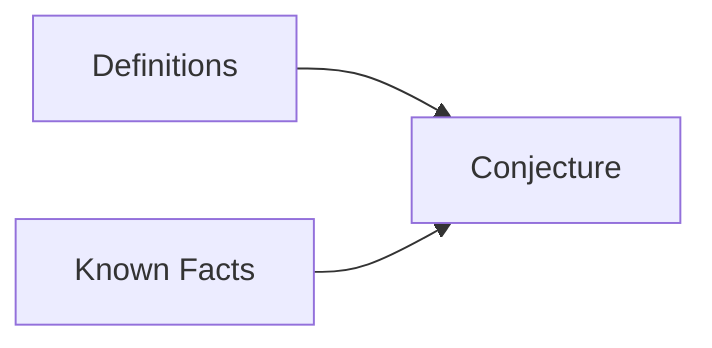

## Proving Existential Statements
An existential statement is a statement in the form: 
`\[\exists x\ Q(x)\]`
This means that there exists a value to which the function `\(Q(x)\)` holds true. This may be under additional parameters.

The easiest way to prove this is to find an `\(x\)` that makes the function `\(Q(x)\)` true. Not all can be proved this way. 

### Examples
1. `\(\exists\)` an even integer `\(n\)` that can be written in two ways as a sum of two prime numbers. 
	`\[10=5+5=7+3\]`
1. There `\(\exists\)` integers `\(m\)` and `\(n\)` such that `\(m>1\)`, `\(n>1\)` and `\(\frac{1}{m} + \frac{1}{n}\)` is an integer.
	`\[m=n=2\]`
		Giving an example is a suitable proof.

## Proving Universal Statements
Generally proofs will require you to answer a universal statement rather than an existential one. an existential statement is of the form:
`\[\forall x \text{ if } P(x) \text{ then } Q(x)\]`
This means that for all of `\(x\)` if one function is applied to `\(x\)` another function in `\(x\)` also holds true. For example:

If `\(a\)` and `\(b\)` are integers then `\(6a^2b\)` is even.
{:.info}

In this statement the "`\(a\)` and `\(b\)` are integers" count for `\(P(x)\)` and "`\(6a^2b\)` is even" counts for `\(Q(x)\)`. 

`\(6a^2b\)`  

`\(2(3a^2b)\)`

By halving you are proving that the answer is even as it is a multiple of two.

### Proof by Exhaustion
For theorems examining a relatively small number of examples you can test each value to see if the statement holds true. That is proof by exhaustion.

#### Example
* Prove that `\((n+1)^3 \geq 3^n\)` if `\(n\)` is a positive number.

As this theorem has such a small scope then each value can be tested to see if it is correct.

### Generalising from the Generic Particular
This method allows for using algebra and known rules to prove a statement generally.

#### Method
* Express the statement to be provided in the form `\(\forall x,\text{ if } P(x) \text{ then } Q(x)\)`
* Start the proof by supposing `\(x\)` is a particular by arbitrarily chosen element for which the hypothesis `\(P(x)\)` is true.
* Show that the conclusion `\(Q(x)\)` is true by using definitions, previously established results, and the rules for logical inference.

This method brings together definitions and facts into a conjecture.
{:.info}

### Example
Prove that the sum of any two even integers is even.

1. (Assume that/Suppose that) `\(m\)` and `\(n\)` are particular but arbitrarily chosen even integers.
1. As we assumed that `\(m\)` is an even integer, `\(m = 2k\)` for some integer `\(k\)`. 
1. Likewise `\(n\)` is an even integer, `\(n = 2l\)`, for some integer `\(l\)`
	* We cannot use the same letter again as `\(k\)` has already been used
1. Then `\(m+n=2k+2l=2(k+l)\)`, which is even as `\(k+l\)` is an integer.

The final step is called the conjecture as is aided by the previous steps to explain why the conjecture holds true.

### Disproving Universal Statement by Counterexample
To disprove a statement means to show that it is false. For example, for a statement such as:
`\[\forall x \text{ if } P(x) \text{ then } Q(x)\]`
You are saying that the opposite is true:
`\[\exists x \text{ such that } P(x) \text{ and not } Q(x)\]`

This means that you must give at least one example that disproves the universal statement.

#### Example
Is it true that for every positive integer `\(n,n^2\geq 2n\)`?

No as for `\(n=1,\ n^2 = 1\)` and `\(2n=2\)` which is greater than `\(n^2\)`
		
You can correct this by stipulating that for ever integer greater than one the statement holds true.
{:.info}
