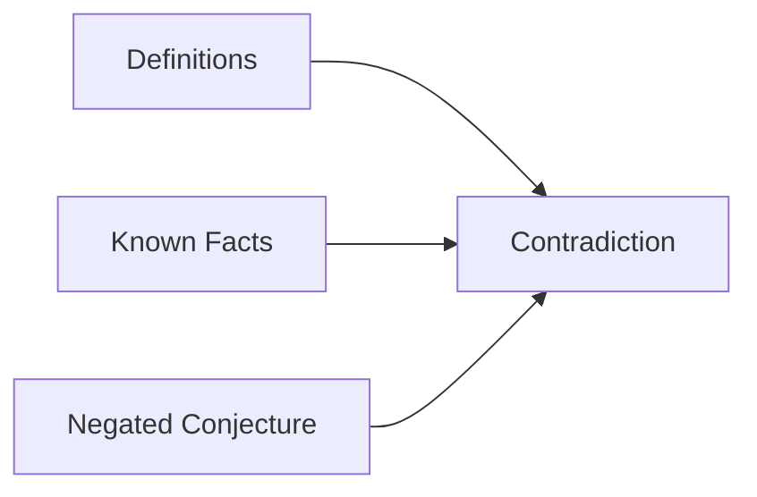

## More Examples of Direct Proof
1. <pre>\(\forall\ n\)</pre> if <pre>\(n\)</pre> is an integer then <pre>\(n\)</pre> is rational. 
	* Proof: Suppose that <pre>\(n\)</pre> is a particular but arbitrarily chosen integer.
		* <pre>\(n=\frac{n}{1}\)</pre>
			* By definition of a rational number <pre>\(\frac{n}{1}\)</pre> is rational.
1. <pre>\(\forall\ r\)</pre> and <pre>\(s\)</pre>, if <pre>\(r,s\)</pre> are rational then <pre>\(r+s\)</pre> is rational.
	* Proof: Suppose that <pre>\(r\)</pre> and <pre>\(s\)</pre> are particular but arbitrarily chosen rational numbers.
		* As <pre>\(r\)</pre> is rational <pre>\(r=\frac{l}{m}\)</pre> where <pre>\(l,m\)</pre> are integers, <pre>\(m\neq 0\)</pre>.
		* As <pre>\(s\)</pre> is rational <pre>\(s=\frac{i}{k}\)</pre> where <pre>\(i,k\)</pre> are integers, <pre>\(k\neq 0\)</pre>.
			* Then <pre>\(r+s = \frac{l}{m} + \frac{i}{k} = \frac{lk+mi}{mk}\)</pre>
				* As <pre>\(m\neq 0, k\neq 0\)</pre> we derive that <pre>\(mk\neq 0\)</pre>
				* As <pre>\(lk+mi,mk\)</pre> are integers, <pre>\(mk\neq 0\)</pre> we conclude that <pre>\(r+s\)</pre> is a rational number. 

## Proof by Cases
For proofs that have multiple cases then you can prove that the statement holds for each case to give a universal proof.

### Example 1
For all integers <pre>\(n,\ n^2 + n\)</pre> is even.

#### Proof
**Case 1:** <pre>\(n\)</pre> is even  

* Then <pre>\(n=2k\)</pre>, for some integer <pre>\(k\)</pre>  
* <pre>\((2k)^2+2k=4k^2+2k=2(2k^2+k)\)</pre>
	* By definition of even, <pre>\(n^2 + n\)</pre> is even. 

**Case 2:** <pre>\(n\)</pre> is odd

* Then <pre>\(n=2k+1\)</pre>, for some integer <pre>\(k\)</pre>.
* <pre>\((2k+1)^2+(2k+1)=4k^2+6k+2=2(2k^2+3k+1)\)</pre>
	* By definition of even, <pre>\(n^2 + n\)</pre> is even. 
	
As both cases (which are all cases) conclude the same thing then the statement is considered proved.

### Example 2
Prove that the product of any two consecutive integers is even. 

#### Rewording
<pre>\(\forall\ n\)</pre> if <pre>\(n\)</pre> is an integer then <pre>\(n(n+1)\)</pre> is even. 

#### Proof
Consider that <pre>\(n\)</pre> is a particular but arbitrarily chosen integer. We proof the statement by a consideration of cases.

**Case 1:** <pre>\(n\)</pre> is even.

* Then <pre>\(n=2k\)</pre>.
	* So <pre>\(n(n+1)=2k(2k+1)\)</pre>.

**Case 2:** <pre>\(n\)</pre> is odd.
	
* Then <pre>\(n=2k+1\)</pre>, for some integer <pre>\(k\)</pre>.
	* So <pre>\(n(n+1)=(2k+1)((2k+1)+1)= (2k+1)(2k+2)\)</pre> <pre>\(= 2(2k+1)(k+1)\)</pre>.

## Indirect proofs
In a direct proof you start with the hypothesis and make deductions until you reach the conclusion.

For an indirect proof you can make use of contradictions to prove statements logically. An example may be in a Sudoku puzzle where you prove which number goes in a square based on the fact that it can't be any other number.

### Proof by Contradiction
If it is not the case that it is not true. It must be the case that it is true.

#### Examples
1. Show that there is not greatest integer.

	Proof: Suppose for a proof by contradiction that the conjecture is not true.  
	Then there is an integer larger than any other integer.  
	Let <pre>\(N\)</pre> be such an integer.
	So <pre>\(N>N+1\)</pre> and therefore 0>1, which is a contradiction.  
	Therefore, our  assumption that the conjecture is not true is false. So there is no greatest integer.
2. No integer can be both even and odd.
	
	Proof: Suppose for a proof by contradiction that this conjecture is not true.  
	Then there exists an integer <pre>\(N\)</pre> which is both even and odd.  
	By definition of even, <pre>\(n=2l\)</pre>, for some integer <pre>\(l\)</pre>. 
	By definition of odd, <pre>\(n=2k+1\)</pre>, for some integer <pre>\(k\)</pre>.  
	<pre>\(2l=n=2k+1\)</pre>. So <pre>\(2l=2k+1\)</pre>. Then <pre>\(2l-2k=1\)</pre>. Then <pre>\(2(k-l) = 1\)</pre>.  
	Then 1 must be even, which is a contradiction.  
	Therefore, we can conclude that no integer can be both even and odd.

### Proof by Contraposition
To prove 
<pre>\[\forall \text{ if } P(x) \text{ then } Q(x)\]</pre>
it suffices to prove  
<pre>\[\forall \text{ if not } P(x) \text{ then not } Q(x)\]</pre>

#### Example
1. For all integers <pre>\(m\)</pre> if <pre>\(m^2\)</pre> is even then <pre>\(m\)</pre> is even.
	* For all integers <pre>\(m\)</pre> if <pre>\(m\)</pre> is not even then <pre>\(m^2\)</pre> is not even.
	
	This can be re-written as:
	
	* For all integers <pre>\(m\)</pre> if <pre>\(m\)</pre> is odd then <pre>\(m^2\)</pre> is odd.

This can then be taken into a direct proof however it may make more sense to prove by contradiction instead of contraposition and it is the preferred method at this time.
