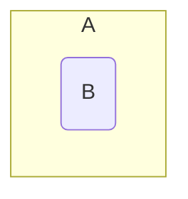

## Subsets
A set &#92;(B&#92;) is called a subset of a set &#92;(A&#92;) if every element of &#92;(B&#92;) is an element of &#92;(A&#92;). This is denoted by &#92;(B\subseteq A&#92;).

### Examples
&#92;[&#92;{3,4,5&#92;}\subseteq&#92;{1,5,4,2,1,3&#92;},\ &#92;{3,3,5&#92;}\subseteq&#92;{3,5&#92;},\ &#92;{5,3&#92;}\subseteq&#92;{3,5&#92;}&#92;]



*Venn diagram of &#92;(B&#92;) subset &#92;(A&#92;).*

Therefore, &#92;(\forall&#92;) sets &#92;(A&#92;), &#92;(A\subseteq A&#92;)
{:.info}

Furthermore, &#92;(\emptyset\subseteq A&#92;) is always true. This is as the empty set is always a subset of any other set including the empty set itself.

#### Subsets in Python
In programming languages such as python you can save on writing out a function to fund whether a set is a subset of another set. To do this you can use the `<` symbol in place of the &#92;(\subseteq&#92;) symbol:

```python
print n<m
```

Where `n` and `m` are both sets.

### Subsets and Bit Vectors Example
Let &#92;(S=\langle1,2,3,4,5\rangle,A=&#92;{1,3,5&#92;}&#92;) and &#92;(B=&#92;{3,4&#92;}&#92;).

* Is &#92;(A\subseteq B&#92;)?

	&#92;(x_a=[1,0,1,0,1]&#92;)  
	&#92;(x_b=[0,0,1,1,0]&#92;)
	
	Therefore &#92;(A\nsubseteq B&#92;). As you can see from the aligned bits. Not all the bits present in &#92;(x_b&#92;) are present in &#92;(x_a&#92;).

* Is the set &#92;(C&#92;), represented by &#92;([1,0,0,0,1]&#92;), a subset  of the set &#92;(D&#92;), represented by &#92;([1,1,0,0,1]&#92;)?
	
	&#92;(C\subseteq D&#92;) as all bits present in the bit vector of &#92;(C&#92;) are also present in the bit vector of &#92;(D&#92;).
	
## Equality
As covered before a set &#92;(A&#92;) is called equal to a set &#92;(B&#92;) if &#92;(A\subseteq B&#92;) and &#92;(B\subseteq A&#92;). This is denoted by &#92;(A=B&#92;).

This is to say that if two sets are subsets of each other then they are equal.

### Confirming Equality
Let &#92;(S=\langle1,2,3,4,5\rangle,A=&#92;{1,3,5&#92;}&#92;) and &#92;(B=&#92;{3,4&#92;}&#92;).

#### Is &#92;(A=B&#92;)?
&#92;(x_a=[1,0,1,0,1]&#92;)  
&#92;(x_b=[0,0,1,1,0]&#92;)

Therefore &#92;(A\neq B&#92;) as the bit vectors do not match.
