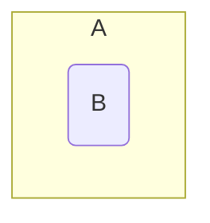

## Subsets
A set <pre>\(B\)</pre> is called a subset of a set <pre>\(A\)</pre> if every element of <pre>\(B\)</pre> is an element of <pre>\(A\)</pre>. This is denoted by <pre>\(B\subseteq A\)</pre>.

### Examples
<pre>\[\{3,4,5\}\subseteq\{1,5,4,2,1,3\},\ \{3,3,5\}\subseteq\{3,5\},\ \{5,3\}\subseteq\{3,5\}\]</pre>



*Venn diagram of <pre>\(B\)</pre> subset <pre>\(A\)</pre>.*

Therefore, <pre>\(\forall\)</pre> sets <pre>\(A\)</pre>, <pre>\(A\subseteq A\)</pre>
{:.info}

Furthermore, <pre>\(\emptyset\subseteq A\)</pre> is always true. This is as the empty set is always a subset of any other set including the empty set itself.

#### Subsets in Python
In programming languages such as python you can save on writing out a function to fund whether a set is a subset of another set. To do this you can use the `<` symbol in place of the <pre>\(\subseteq\)</pre> symbol:

```python
print n<m
```

Where `n` and `m` are both sets.

### Subsets and Bit Vectors Example
Let <pre>\(S=\langle1,2,3,4,5\rangle,A=\{1,3,5\}\)</pre> and <pre>\(B=\{3,4\}\)</pre>.

* Is <pre>\(A\subseteq B\)</pre>?

	<pre>\(x_a=[1,0,1,0,1]\)</pre>  
	<pre>\(x_b=[0,0,1,1,0]\)</pre>
	
	Therefore <pre>\(A\nsubseteq B\)</pre>. As you can see from the aligned bits. Not all the bits present in <pre>\(x_b\)</pre> are present in <pre>\(x_a\)</pre>.

* Is the set <pre>\(C\)</pre>, represented by <pre>\([1,0,0,0,1]\)</pre>, a subset  of the set <pre>\(D\)</pre>, represented by <pre>\([1,1,0,0,1]\)</pre>?
	
	<pre>\(C\subseteq D\)</pre> as all bits present in the bit vector of <pre>\(C\)</pre> are also present in the bit vector of <pre>\(D\)</pre>.
	
## Equality
As covered before a set <pre>\(A\)</pre> is called equal to a set <pre>\(B\)</pre> if <pre>\(A\subseteq B\)</pre> and <pre>\(B\subseteq A\)</pre>. This is denoted by <pre>\(A=B\)</pre>.

This is to say that if two sets are subsets of each other then they are equal.

### Confirming Equality
Let <pre>\(S=\langle1,2,3,4,5\rangle,A=\{1,3,5\}\)</pre> and <pre>\(B=\{3,4\}\)</pre>.

#### Is <pre>\(A=B\)</pre>?
<pre>\(x_a=[1,0,1,0,1]\)</pre>  
<pre>\(x_b=[0,0,1,1,0]\)</pre>

Therefore <pre>\(A\neq B\)</pre> as the bit vectors do not match.
