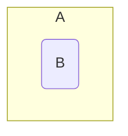

## Subsets
A set <![CDATA[\(B\)]]> is called a subset of a set <![CDATA[\(A\)]]> if every element of <![CDATA[\(B\)]]> is an element of <![CDATA[\(A\)]]>. This is denoted by <![CDATA[\(B\subseteq A\)]]>.

### Examples
<![CDATA[\[\{3,4,5\}\subseteq\{1,5,4,2,1,3\},\ \{3,3,5\}\subseteq\{3,5\},\ \{5,3\}\subseteq\{3,5\}\]]]>



*Venn diagram of <![CDATA[\(B\)]]> subset <![CDATA[\(A\)]]>.*

Therefore, <![CDATA[\(\forall\)]]> sets <![CDATA[\(A\)]]>, <![CDATA[\(A\subseteq A\)]]>
{:.info}

Furthermore, <![CDATA[\(\emptyset\subseteq A\)]]> is always true. This is as the empty set is always a subset of any other set including the empty set itself.

#### Subsets in Python
In programming languages such as python you can save on writing out a function to fund whether a set is a subset of another set. To do this you can use the `<` symbol in place of the <![CDATA[\(\subseteq\)]]> symbol:

```python
print n<m
```

Where `n` and `m` are both sets.

### Subsets and Bit Vectors Example
Let <![CDATA[\(S=\langle1,2,3,4,5\rangle,A=\{1,3,5\}\)]]> and <![CDATA[\(B=\{3,4\}\)]]>.

* Is <![CDATA[\(A\subseteq B\)]]>?

	<![CDATA[\(x_a=[1,0,1,0,1]\)]]>  
	<![CDATA[\(x_b=[0,0,1,1,0]\)]]>
	
	Therefore <![CDATA[\(A\nsubseteq B\)]]>. As you can see from the aligned bits. Not all the bits present in <![CDATA[\(x_b\)]]> are present in <![CDATA[\(x_a\)]]>.

* Is the set <![CDATA[\(C\)]]>, represented by <![CDATA[\([1,0,0,0,1]\)]]>, a subset  of the set <![CDATA[\(D\)]]>, represented by <![CDATA[\([1,1,0,0,1]\)]]>?
	
	<![CDATA[\(C\subseteq D\)]]> as all bits present in the bit vector of <![CDATA[\(C\)]]> are also present in the bit vector of <![CDATA[\(D\)]]>.
	
## Equality
As covered before a set <![CDATA[\(A\)]]> is called equal to a set <![CDATA[\(B\)]]> if <![CDATA[\(A\subseteq B\)]]> and <![CDATA[\(B\subseteq A\)]]>. This is denoted by <![CDATA[\(A=B\)]]>.

This is to say that if two sets are subsets of each other then they are equal.

### Confirming Equality
Let <![CDATA[\(S=\langle1,2,3,4,5\rangle,A=\{1,3,5\}\)]]> and <![CDATA[\(B=\{3,4\}\)]]>.

#### Is <![CDATA[\(A=B\)]]>?
<![CDATA[\(x_a=[1,0,1,0,1]\)]]>  
<![CDATA[\(x_b=[0,0,1,1,0]\)]]>

Therefore <![CDATA[\(A\neq B\)]]> as the bit vectors do not match.
