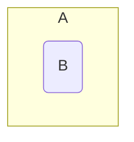

## Subsets
A set \(B\) is called a subset of a set \(A\) if every element of \(B\) is an element of \(A\). This is denoted by \(B\subseteq A\).

### Examples
\]\{3,4,5\}\subseteq\{1,5,4,2,1,3\},\ \{3,3,5\}\subseteq\{3,5\},\ \{5,3\}\subseteq\{3,5\}\]



*Venn diagram of \(B\) subset \(A\).*

Therefore, \(\forall\) sets \(A\), \(A\subseteq A\)
{:.info}

Furthermore, \(\emptyset\subseteq A\) is always true. This is as the empty set is always a subset of any other set including the empty set itself.

#### Subsets in Python
In programming languages such as python you can save on writing out a function to fund whether a set is a subset of another set. To do this you can use the `<` symbol in place of the \(\subseteq\) symbol:

```python
print n<m
```

Where `n` and `m` are both sets.

### Subsets and Bit Vectors Example
Let \(S=\langle1,2,3,4,5\rangle,A=\{1,3,5\}\) and \(B=\{3,4\}\).

* Is \(A\subseteq B\)?

	\(x_a=[1,0,1,0,1]\)  
	\(x_b=[0,0,1,1,0]\)
	
	Therefore \(A\nsubseteq B\). As you can see from the aligned bits. Not all the bits present in \(x_b\) are present in \(x_a\).

* Is the set \(C\), represented by \([1,0,0,0,1]\), a subset  of the set \(D\), represented by \([1,1,0,0,1]\)?
	
	\(C\subseteq D\) as all bits present in the bit vector of \(C\) are also present in the bit vector of \(D\).
	
## Equality
As covered before a set \(A\) is called equal to a set \(B\) if \(A\subseteq B\) and \(B\subseteq A\). This is denoted by \(A=B\).

This is to say that if two sets are subsets of each other then they are equal.

### Confirming Equality
Let \(S=\langle1,2,3,4,5\rangle,A=\{1,3,5\}\) and \(B=\{3,4\}\).

#### Is \(A=B\)?
\(x_a=[1,0,1,0,1]\)  
\(x_b=[0,0,1,1,0]\)

Therefore \(A\neq B\) as the bit vectors do not match.
