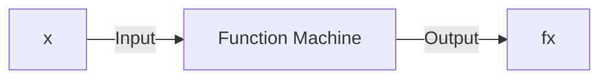
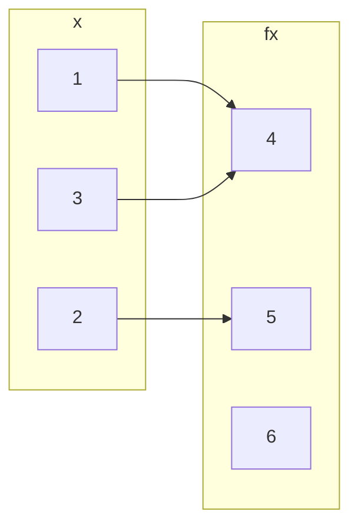
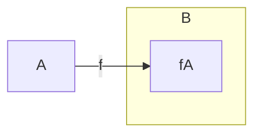

## Basics and Definitions
A function is a method that takes an input value and gives an output value:



A function from a set <pre>\(A\)</pre> to a set <pre>\(B\)</pre> is an assignment of exactly one element of <pre>\(B\)</pre> to each element of <pre>\(A\)</pre>.

We write <pre>\(f(a)=b\)</pre> if <pre>\(b\)</pre> is the unique element of <pre>\(B\)</pre> assigned by the function <pre>\(f\)</pre> to the element of <pre>\(a\)</pre>.

If <pre>\(f\)</pre> is a function from <pre>\(A\)</pre> to <pre>\(B\)</pre> we write <pre>\(f: A\rightarrow B\)</pre>.


*A function <pre>\(f:\{1,2,3\} \rightarrow \{4,5,6\}\)</pre>.*

For every value on the left there should be a **single** value associated to it on the right.

## Domain, Co-domain & Range
Suppose <pre>\(f:A\rightarrow B\)</pre>

* <pre>\(A\)</pre> is called the domain of <pre>\(f\)</pre>.
* <pre>\(B\)</pre> is called the co-domain fo <pre>\(f\)</pre>.
* The range <pre>\(f(A)\)</pre> of <pre>\(f\)</pre> is <pre>\(f(A)=\{f(x)\vert x\in A\}\)</pre>.

### Co-domain v.s. Range
The difference between co-domain and range is that the co-domain is all values in the set <pre>\(B\)</pre> and the range is all the values, <pre>\(f(x)\)</pre>, that <pre>\(A\)</pre> maps to via the function <pre>\(f\)</pre>.


*The range of <pre>\(f\)</pre>.*

#### Example
Give the range of the function:

<pre>\[\sin(x):\mathbb{R}\rightarrow\mathbb{R}\]</pre>

The range of the function would be:

<pre>\[\sin(x)=\{x\in\mathbb{R}\vert -1\leq x\leq 1\}\]</pre>

## Composition of Functions
If <pre>\(f:X\rightarrow Y\)</pre> and <pre>\(g:Y\rightarrow Z\)</pre> are functions, then their composition <pre>\(g\circ f\)</pre> is a function from <pre>\(X\)</pre> to <pre>\(Z\)</pre> given by:

<pre>\[(g\circ f)(x)=g(f(x))\]</pre>

```mermaid
graph LR
subgraph X
x
end
subgraph Y
subgraph Y'
fx
end
end
subgraph Z
gfx
end

x --> fx
fx --> gfx
x --> gfx
X -->|f| Y
Y -->|g| Z
