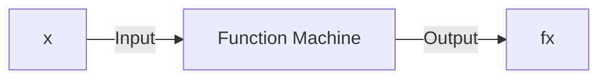
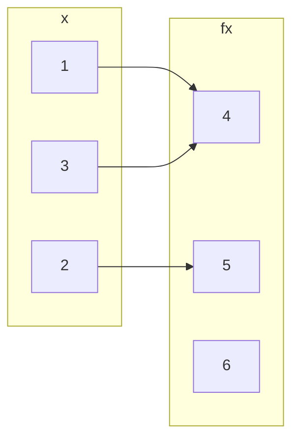
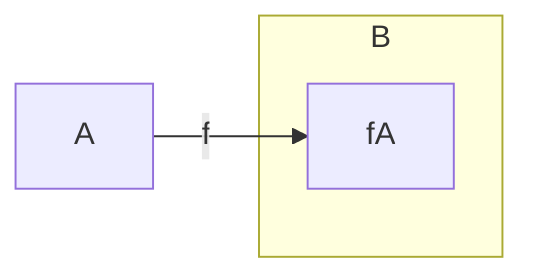

## Basics and Definitions
A function is a method that takes an input value and gives an output value:



A function from a set \#92;(A\#92;) to a set \#92;(B\#92;) is an assignment of exactly one element of \#92;(B\#92;) to each element of \#92;(A\#92;).

We write \#92;(f(a)=b\#92;) if \#92;(b\#92;) is the unique element of \#92;(B\#92;) assigned by the function \#92;(f\#92;) to the element of \#92;(a\#92;).

If \#92;(f\#92;) is a function from \#92;(A\#92;) to \#92;(B\#92;) we write \#92;(f: A\#92;rightarrow B\#92;).


*A function \#92;(f:\#92;{1,2,3\#92;} \#92;rightarrow \#92;{4,5,6\#92;}\#92;).*

For every value on the left there should be a **single** value associated to it on the right.

## Domain, Co-domain & Range
Suppose \#92;(f:A\#92;rightarrow B\#92;)

* \#92;(A\#92;) is called the domain of \#92;(f\#92;).
* \#92;(B\#92;) is called the co-domain fo \#92;(f\#92;).
* The range \#92;(f(A)\#92;) of \#92;(f\#92;) is \#92;(f(A)=\#92;{f(x)\#92;vert x\#92;in A\#92;}\#92;).

### Co-domain v.s. Range
The difference between co-domain and range is that the co-domain is all values in the set \#92;(B\#92;) and the range is all the values, \#92;(f(x)\#92;), that \#92;(A\#92;) maps to via the function \#92;(f\#92;).


*The range of \#92;(f\#92;).*

#### Example
Give the range of the function:

\#92;[\#92;sin(x):\#92;mathbb{R}\#92;rightarrow\#92;mathbb{R}\#92;]

The range of the function would be:

\#92;[\#92;sin(x)=\#92;{x\#92;in\#92;mathbb{R}\#92;vert -1\#92;leq x\#92;leq 1\#92;}\#92;]

## Composition of Functions
If \#92;(f:X\#92;rightarrow Y\#92;) and \#92;(g:Y\#92;rightarrow Z\#92;) are functions, then their composition \#92;(g\#92;circ f\#92;) is a function from \#92;(X\#92;) to \#92;(Z\#92;) given by:

\#92;[(g\#92;circ f)(x)=g(f(x))\#92;]

```mermaid
graph LR
subgraph X
x
end
subgraph Y
subgraph Y'
fx
end
end
subgraph Z
gfx
end

x --> fx
fx --> gfx
x --> gfx
X -->|f| Y
Y -->|g| Z
