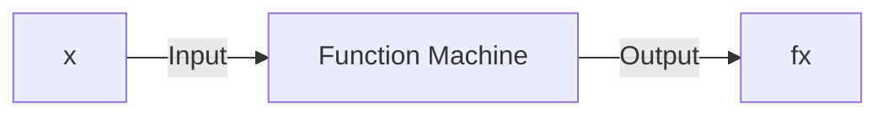
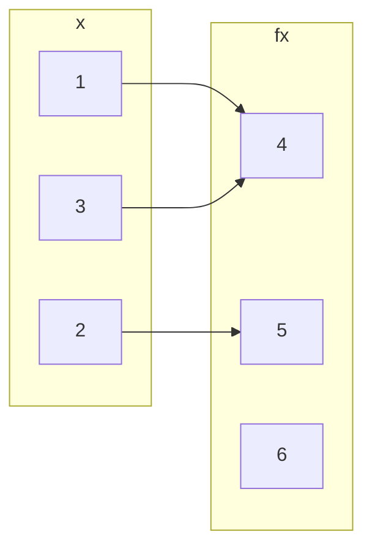
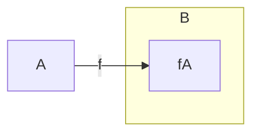

## Basics and Definitions
A function is a method that takes an input value and gives an output value:



A function from a set $A$ to a set $B$ is an assignment of exactly one element of $B$ to each element of $A$.

We write $f(a)=b$ if $b$ is the unique element of $B$ assigned by the function $f$ to the element of $a$.

If $f$ is a function from $A$ to $B$ we write $f: A\rightarrow B$.


*A function $f:\\\{1,2,3\\\} \rightarrow \\\{4,5,6\\\}$.*

For every value on the left there should be a **single** value associated to it on the right.

## Domain, Co-domain & Range
Suppose $f:A\rightarrow B$

* $A$ is called the domain of $f$.
* $B$ is called the co-domain fo $f$.
* The range $f(A)$ of $f$ is $f(A)=\\\{f(x)\vert x\in A\\\}$.

### Co-domain v.s. Range
The difference between co-domain and range is that the co-domain is all values in the set $B$ and the range is all the values, $f(x)$, that $A$ maps to via the function $f$.


*The range of $f$.*

#### Example
Give the range of the function:

$$\sin(x):\mathbb{R}\rightarrow\mathbb{R}$$

The range of the function would be:

$$\sin(x)=\\\{x\in\mathbb{R}\vert -1\leq x\leq 1\\\}$$

## Composition of Functions
If $f:X\rightarrow Y$ and $g:Y\rightarrow Z$ are functions, then their composition $g\circ f$ is a function from $X$ to $Z$ given by:

$$(g\circ f)(x)=g(f(x))$$

```mermaid
graph LR
subgraph X
x
end
subgraph Y
subgraph Y'
fx
end
end
subgraph Z
gfx
end

x --> fx
fx --> gfx
x --> gfx
X -->|f| Y
Y -->|g| Z
