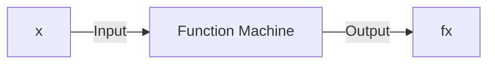
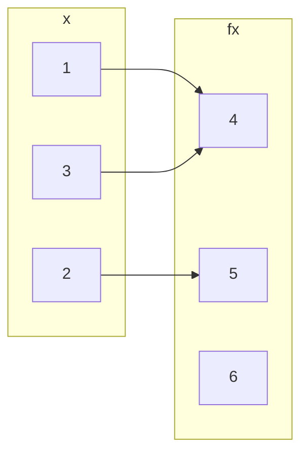
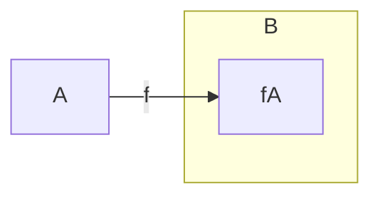

## Basics and Definitions
A function is a method that takes an input value and gives an output value:



A function from a set `\(A\)` to a set `\(B\)` is an assignment of exactly one element of `\(B\)` to each element of `\(A\)`.

We write `\(f(a)=b\)` if `\(b\)` is the unique element of `\(B\)` assigned by the function `\(f\)` to the element of `\(a\)`.

If `\(f\)` is a function from `\(A\)` to `\(B\)` we write `\(f: A\rightarrow B\)`.


*A function `\(f:\{1,2,3\} \rightarrow \{4,5,6\}\)`.*

For every value on the left there should be a **single** value associated to it on the right.

## Domain, Co-domain & Range
Suppose `\(f:A\rightarrow B\)`

* `\(A\)` is called the domain of `\(f\)`.
* `\(B\)` is called the co-domain fo `\(f\)`.
* The range `\(f(A)\)` of `\(f\)` is `\(f(A)=\{f(x)\vert x\in A\}\)`.

### Co-domain v.s. Range
The difference between co-domain and range is that the co-domain is all values in the set `\(B\)` and the range is all the values, `\(f(x)\)`, that `\(A\)` maps to via the function `\(f\)`.


*The range of `\(f\)`.*

#### Example
Give the range of the function:

`\[\sin(x):\mathbb{R}\rightarrow\mathbb{R}\]`

The range of the function would be:

`\[\sin(x)=\{x\in\mathbb{R}\vert -1\leq x\leq 1\}\]`

## Composition of Functions
If `\(f:X\rightarrow Y\)` and `\(g:Y\rightarrow Z\)` are functions, then their composition `\(g\circ f\)` is a function from `\(X\)` to `\(Z\)` given by:

`\[(g\circ f)(x)=g(f(x))\]`

```mermaid
graph LR
subgraph X
x
end
subgraph Y
subgraph Y'
fx
end
end
subgraph Z
gfx
end

x --> fx
fx --> gfx
x --> gfx
X -->|f| Y
Y -->|g| Z
