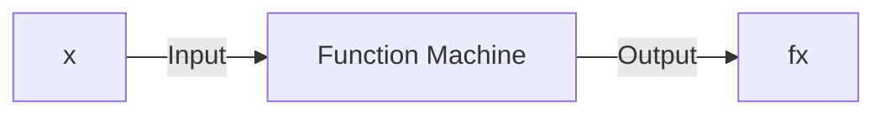
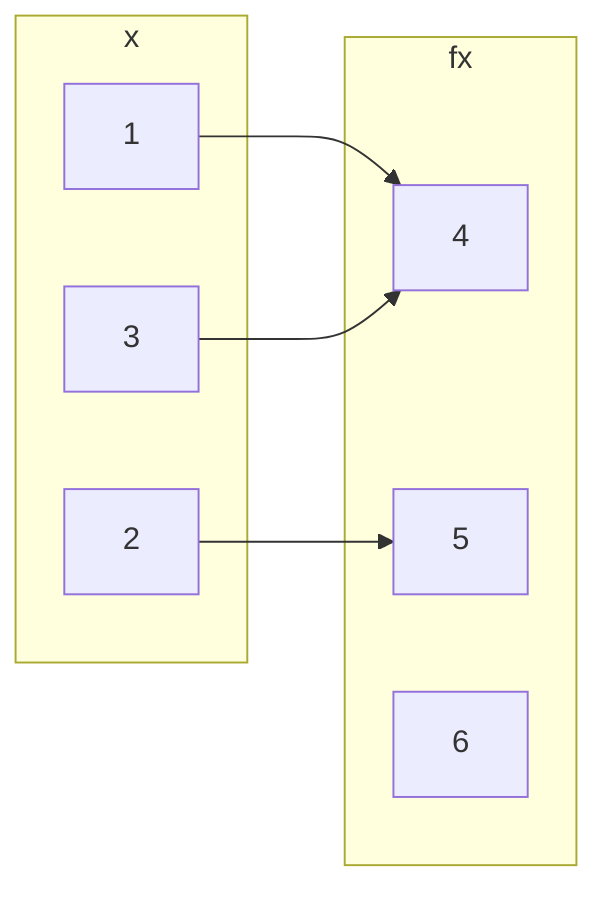
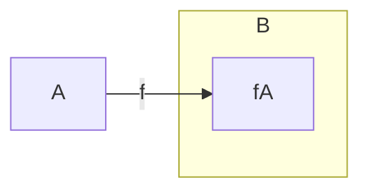

## Basics and Definitions
A function is a method that takes an input value and gives an output value:



A function from a set <![CDATA[\(A\)]]> to a set <![CDATA[\(B\)]]> is an assignment of exactly one element of <![CDATA[\(B\)]]> to each element of <![CDATA[\(A\)]]>.

We write <![CDATA[\(f(a)=b\)]]> if <![CDATA[\(b\)]]> is the unique element of <![CDATA[\(B\)]]> assigned by the function <![CDATA[\(f\)]]> to the element of <![CDATA[\(a\)]]>.

If <![CDATA[\(f\)]]> is a function from <![CDATA[\(A\)]]> to <![CDATA[\(B\)]]> we write <![CDATA[\(f: A\rightarrow B\)]]>.


*A function <![CDATA[\(f:\{1,2,3\} \rightarrow \{4,5,6\}\)]]>.*

For every value on the left there should be a **single** value associated to it on the right.

## Domain, Co-domain & Range
Suppose <![CDATA[\(f:A\rightarrow B\)]]>

* <![CDATA[\(A\)]]> is called the domain of <![CDATA[\(f\)]]>.
* <![CDATA[\(B\)]]> is called the co-domain fo <![CDATA[\(f\)]]>.
* The range <![CDATA[\(f(A)\)]]> of <![CDATA[\(f\)]]> is <![CDATA[\(f(A)=\{f(x)\vert x\in A\}\)]]>.

### Co-domain v.s. Range
The difference between co-domain and range is that the co-domain is all values in the set <![CDATA[\(B\)]]> and the range is all the values, <![CDATA[\(f(x)\)]]>, that <![CDATA[\(A\)]]> maps to via the function <![CDATA[\(f\)]]>.


*The range of <![CDATA[\(f\)]]>.*

#### Example
Give the range of the function:

<![CDATA[\[\sin(x):\mathbb{R}\rightarrow\mathbb{R}\]]]>

The range of the function would be:

<![CDATA[\[\sin(x)=\{x\in\mathbb{R}\vert -1\leq x\leq 1\}\]]]>

## Composition of Functions
If <![CDATA[\(f:X\rightarrow Y\)]]> and <![CDATA[\(g:Y\rightarrow Z\)]]> are functions, then their composition <![CDATA[\(g\circ f\)]]> is a function from <![CDATA[\(X\)]]> to <![CDATA[\(Z\)]]> given by:

<![CDATA[\[(g\circ f)(x)=g(f(x))\]]]>

```mermaid
graph LR
subgraph X
x
end
subgraph Y
subgraph Y'
fx
end
end
subgraph Z
gfx
end

x --> fx
fx --> gfx
x --> gfx
X -->|f| Y
Y -->|g| Z
