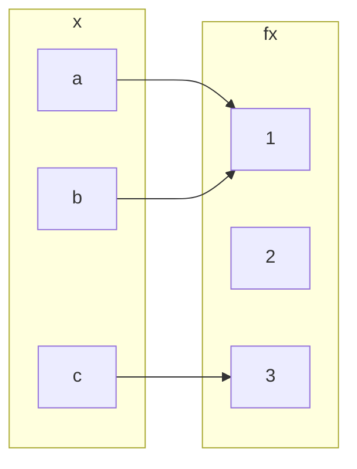

## Injective (one-to-one) Functions
Let <pre>\(f:A\rightarrow B\)</pre> be a function. We call <pre>\(f\)</pre> and injective, or one-to-one, function if:

<pre>\[f(a_1)=f(a_2)\Rightarrow a_1 = a_2 \text{ for all } a_1,a_2\in A\]</pre>

This is logically equivalent to <pre>\(a_1\neq a_2 \Rightarrow f(a_1) \neq f(a_2)\)</pre> and so injective functions never repeat values. In other words:

Different inputs give different outputs.
{:.info}

### Example 1
<pre>\(f:\mathbb{Z}\rightarrow \mathbb{Z}\)</pre> given by <pre>\(f(x)=x^2\)</pre> is not injective.

<pre>\(h:\mathbb{Z}\rightarrow \mathbb{Z}\)</pre> given by <pre>\(h(x)=2x\)</pre> is injective.

### Example 2
To prove that a function is not injective you can give an individual example of a double mapping.

Take the following question foe the opposite:

<pre>\(h:\mathbb{Z}\rightarrow \mathbb{Z}\)</pre> given by <pre>\(h(x)=2x\)</pre> is injective.

#### Proof
Suppose for a proof by contradiction that there exist <pre>\(a_1,a_2\)</pre> such that <pre>\(h(a_1=h(a_2)\)</pre> and <pre>\(a_1\neq a_2\)</pre>.

<pre>\(2\times a_1 = 2a_2 \Rightarrow a_1 = a_2\)</pre>, a contradiction.

## Surjective (or onto) Functions
<pre>\(f:A\rightarrow B\)</pre> is surjective, or onto, if the range of <pre>\(f\)</pre> coincides with the co-domain <pre>\(f\)</pre>. This means that for every <pre>\(b\in B\)</pre> there exists an <pre>\(a\in A\)</pre> with <pre>\(b=f(a)\)</pre>.

### Examples
<pre>\(h:\mathbb{Z}\rightarrow \mathbb{Z}\)</pre> given by <pre>\(h(x)=2x\)</pre> is not surjective.

This is because you get every even values out as an answer.

<pre>\(h':\mathbb{Q}\rightarrow \mathbb{Q}\)</pre> given by <pre>\(h'(x)=2x\)</pre> is surjective.

This is as you can use rational numbers to make any other number when doubled.

## Question
Classify <pre>\(f:\{a,b,c\}\rightarrow\{1,2,3\}\)</pre> given by:

* It is a function.
* Not injective, <pre>\(f(a)=f(b)=1\)</pre>
* Not subjective as no <pre>\(x\)</pre> maps with <pre>\(f(x)=2\)</pre>.

## Bijections
We call <pre>\(f\)</pre> bijective if <pre>\(f\)</pre> is both injective and surjective.

### Examples
<pre>\(f:\mathbb{Q}\rightarrow \mathbb{Q}\)</pre> given by <pre>\(f(x)=2x\)</pre> is bijective.

## Inverse Functions
If <pre>\(f\)</pre> is a bijection from a set <pre>\(X\)</pre> to a set <pre>\(Y\)</pre>, then there is a function <pre>\(f^{-1}\)</pre> from <pre>\(Y\)</pre> to <pre>\(X\)</pre> that undoes the action of <pre>\(f\)</pre>; that is, it sends each element of <pre>\(Y\)</pre> back to the element of <pre>\(X\)</pre> that it came from. This function is called the inverse function for <pre>\(f\)</pre>.

Then <pre>\(f(a)=b\)</pre> if, and only if, <pre>\(f^{-1}(b)=a\)</pre>

### Example
<pre>\(k:\mathbb{R}\rightarrow \mathbb{R}\)</pre> given by <pre>\(k(x)=4x+3\)</pre> is invertible and <pre>\(k^{-1}(y)=\frac{1}{4}(y-3)\)</pre>. 

<pre>\(y=4x+3\)</pre>. So <pre>\(4x+3=y\)</pre>, <pre>\(4x=y-3\)</pre>, <pre>\(x = \frac{y-3}{4}\)</pre>

This proves the statement by giving the same value.
