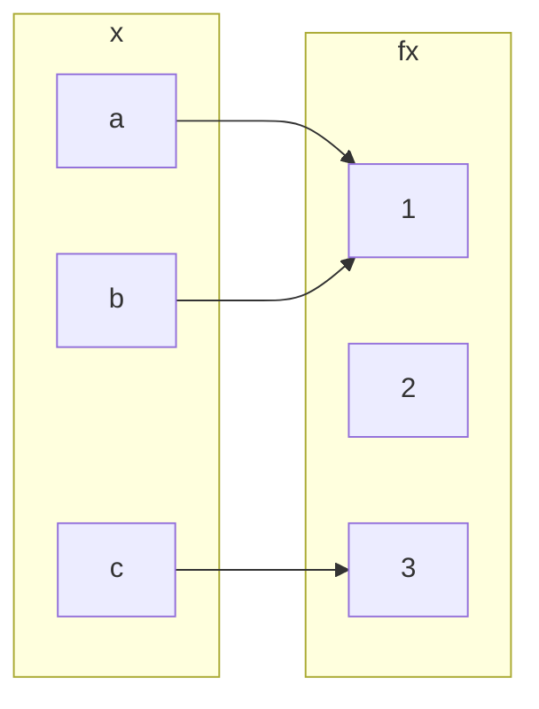

## Injective (one-to-one) Functions
Let <![CDATA[\(f:A\rightarrow B\)]]> be a function. We call <![CDATA[\(f\)]]> and injective, or one-to-one, function if:

<![CDATA[\[f(a_1)=f(a_2)\Rightarrow a_1 = a_2 \text{ for all } a_1,a_2\in A\]]]>

This is logically equivalent to <![CDATA[\(a_1\neq a_2 \Rightarrow f(a_1) \neq f(a_2)\)]]> and so injective functions never repeat values. In other words:

Different inputs give different outputs.
{:.info}

### Example 1
<![CDATA[\(f:\mathbb{Z}\rightarrow \mathbb{Z}\)]]> given by <![CDATA[\(f(x)=x^2\)]]> is not injective.

<![CDATA[\(h:\mathbb{Z}\rightarrow \mathbb{Z}\)]]> given by <![CDATA[\(h(x)=2x\)]]> is injective.

### Example 2
To prove that a function is not injective you can give an individual example of a double mapping.

Take the following question foe the opposite:

<![CDATA[\(h:\mathbb{Z}\rightarrow \mathbb{Z}\)]]> given by <![CDATA[\(h(x)=2x\)]]> is injective.

#### Proof
Suppose for a proof by contradiction that there exist <![CDATA[\(a_1,a_2\)]]> such that <![CDATA[\(h(a_1=h(a_2)\)]]> and <![CDATA[\(a_1\neq a_2\)]]>.

<![CDATA[\(2\times a_1 = 2a_2 \Rightarrow a_1 = a_2\)]]>, a contradiction.

## Surjective (or onto) Functions
<![CDATA[\(f:A\rightarrow B\)]]> is surjective, or onto, if the range of <![CDATA[\(f\)]]> coincides with the co-domain <![CDATA[\(f\)]]>. This means that for every <![CDATA[\(b\in B\)]]> there exists an <![CDATA[\(a\in A\)]]> with <![CDATA[\(b=f(a)\)]]>.

### Examples
<![CDATA[\(h:\mathbb{Z}\rightarrow \mathbb{Z}\)]]> given by <![CDATA[\(h(x)=2x\)]]> is not surjective.

This is because you get every even values out as an answer.

<![CDATA[\(h':\mathbb{Q}\rightarrow \mathbb{Q}\)]]> given by <![CDATA[\(h'(x)=2x\)]]> is surjective.

This is as you can use rational numbers to make any other number when doubled.

## Question
Classify <![CDATA[\(f:\{a,b,c\}\rightarrow\{1,2,3\}\)]]> given by:

* It is a function.
* Not injective, <![CDATA[\(f(a)=f(b)=1\)]]>
* Not subjective as no <![CDATA[\(x\)]]> maps with <![CDATA[\(f(x)=2\)]]>.

## Bijections
We call <![CDATA[\(f\)]]> bijective if <![CDATA[\(f\)]]> is both injective and surjective.

### Examples
<![CDATA[\(f:\mathbb{Q}\rightarrow \mathbb{Q}\)]]> given by <![CDATA[\(f(x)=2x\)]]> is bijective.

## Inverse Functions
If <![CDATA[\(f\)]]> is a bijection from a set <![CDATA[\(X\)]]> to a set <![CDATA[\(Y\)]]>, then there is a function <![CDATA[\(f^{-1}\)]]> from <![CDATA[\(Y\)]]> to <![CDATA[\(X\)]]> that undoes the action of <![CDATA[\(f\)]]>; that is, it sends each element of <![CDATA[\(Y\)]]> back to the element of <![CDATA[\(X\)]]> that it came from. This function is called the inverse function for <![CDATA[\(f\)]]>.

Then <![CDATA[\(f(a)=b\)]]> if, and only if, <![CDATA[\(f^{-1}(b)=a\)]]>

### Example
<![CDATA[\(k:\mathbb{R}\rightarrow \mathbb{R}\)]]> given by <![CDATA[\(k(x)=4x+3\)]]> is invertible and <![CDATA[\(k^{-1}(y)=\frac{1}{4}(y-3)\)]]>. 

<![CDATA[\(y=4x+3\)]]>. So <![CDATA[\(4x+3=y\)]]>, <![CDATA[\(4x=y-3\)]]>, <![CDATA[\(x = \frac{y-3}{4}\)]]>

This proves the statement by giving the same value.
