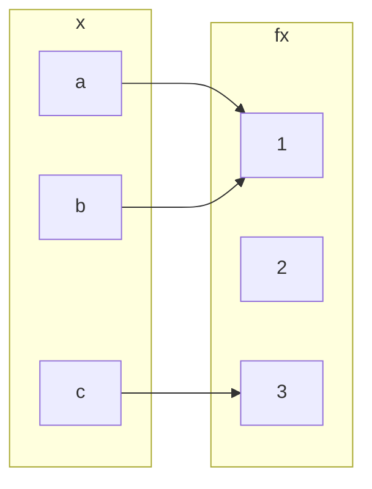

## Injective (one-to-one) Functions
Let `\(f:A\rightarrow B\)` be a function. We call `\(f\)` and injective, or one-to-one, function if:

`\[f(a_1)=f(a_2)\Rightarrow a_1 = a_2 \text{ for all } a_1,a_2\in A\]`

This is logically equivalent to `\(a_1\neq a_2 \Rightarrow f(a_1) \neq f(a_2)\)` and so injective functions never repeat values. In other words:

Different inputs give different outputs.
{:.info}

### Example 1
`\(f:\mathbb{Z}\rightarrow \mathbb{Z}\)` given by `\(f(x)=x^2\)` is not injective.

`\(h:\mathbb{Z}\rightarrow \mathbb{Z}\)` given by `\(h(x)=2x\)` is injective.

### Example 2
To prove that a function is not injective you can give an individual example of a double mapping.

Take the following question foe the opposite:

`\(h:\mathbb{Z}\rightarrow \mathbb{Z}\)` given by `\(h(x)=2x\)` is injective.

#### Proof
Suppose for a proof by contradiction that there exist `\(a_1,a_2\)` such that `\(h(a_1=h(a_2)\)` and `\(a_1\neq a_2\)`.

`\(2\times a_1 = 2a_2 \Rightarrow a_1 = a_2\)`, a contradiction.

## Surjective (or onto) Functions
`\(f:A\rightarrow B\)` is surjective, or onto, if the range of `\(f\)` coincides with the co-domain `\(f\)`. This means that for every `\(b\in B\)` there exists an `\(a\in A\)` with `\(b=f(a)\)`.

### Examples
`\(h:\mathbb{Z}\rightarrow \mathbb{Z}\)` given by `\(h(x)=2x\)` is not surjective.

This is because you get every even values out as an answer.

`\(h':\mathbb{Q}\rightarrow \mathbb{Q}\)` given by `\(h'(x)=2x\)` is surjective.

This is as you can use rational numbers to make any other number when doubled.

## Question
Classify `\(f:\{a,b,c\}\rightarrow\{1,2,3\}\)` given by:

* It is a function.
* Not injective, `\(f(a)=f(b)=1\)`
* Not subjective as no `\(x\)` maps with `\(f(x)=2\)`.

## Bijections
We call `\(f\)` bijective if `\(f\)` is both injective and surjective.

### Examples
`\(f:\mathbb{Q}\rightarrow \mathbb{Q}\)` given by `\(f(x)=2x\)` is bijective.

## Inverse Functions
If `\(f\)` is a bijection from a set `\(X\)` to a set `\(Y\)`, then there is a function `\(f^{-1}\)` from `\(Y\)` to `\(X\)` that undoes the action of `\(f\)`; that is, it sends each element of `\(Y\)` back to the element of `\(X\)` that it came from. This function is called the inverse function for `\(f\)`.

Then `\(f(a)=b\)` if, and only if, `\(f^{-1}(b)=a\)`

### Example
`\(k:\mathbb{R}\rightarrow \mathbb{R}\)` given by `\(k(x)=4x+3\)` is invertible and `\(k^{-1}(y)=\frac{1}{4}(y-3)\)`. 

`\(y=4x+3\)`. So `\(4x+3=y\)`, `\(4x=y-3\)`, `\(x = \frac{y-3}{4}\)`

This proves the statement by giving the same value.
