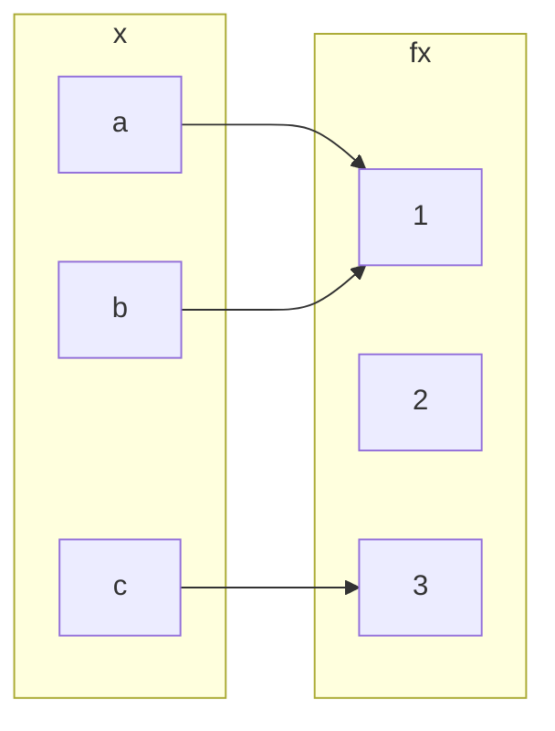

## Injective (one-to-one) Functions
Let &#92;(f:A\rightarrow B&#92;) be a function. We call &#92;(f&#92;) and injective, or one-to-one, function if:

&#92;[f(a&#95;1)=f(a&#95;2)\Rightarrow a&#95;1 = a&#95;2 \text{ for all } a&#95;1,a&#95;2\in A&#92;]

This is logically equivalent to &#92;(a&#95;1\neq a&#95;2 \Rightarrow f(a&#95;1) \neq f(a&#95;2)&#92;) and so injective functions never repeat values. In other words:

Different inputs give different outputs.
{:.info}

### Example 1
&#92;(f:\mathbb{Z}\rightarrow \mathbb{Z}&#92;) given by &#92;(f(x)=x^2&#92;) is not injective.

&#92;(h:\mathbb{Z}\rightarrow \mathbb{Z}&#92;) given by &#92;(h(x)=2x&#92;) is injective.

### Example 2
To prove that a function is not injective you can give an individual example of a double mapping.

Take the following question foe the opposite:

&#92;(h:\mathbb{Z}\rightarrow \mathbb{Z}&#92;) given by &#92;(h(x)=2x&#92;) is injective.

#### Proof
Suppose for a proof by contradiction that there exist &#92;(a&#95;1,a&#95;2&#92;) such that &#92;(h(a&#95;1=h(a&#95;2)&#92;) and &#92;(a&#95;1\neq a&#95;2&#92;).

&#92;(2\times a&#95;1 = 2a&#95;2 \Rightarrow a&#95;1 = a&#95;2&#92;), a contradiction.

## Surjective (or onto) Functions
&#92;(f:A\rightarrow B&#92;) is surjective, or onto, if the range of &#92;(f&#92;) coincides with the co-domain &#92;(f&#92;). This means that for every &#92;(b\in B&#92;) there exists an &#92;(a\in A&#92;) with &#92;(b=f(a)&#92;).

### Examples
&#92;(h:\mathbb{Z}\rightarrow \mathbb{Z}&#92;) given by &#92;(h(x)=2x&#92;) is not surjective.

This is because you get every even values out as an answer.

&#92;(h':\mathbb{Q}\rightarrow \mathbb{Q}&#92;) given by &#92;(h'(x)=2x&#92;) is surjective.

This is as you can use rational numbers to make any other number when doubled.

## Question
Classify &#92;(f:&#92;{a,b,c&#92;}\rightarrow&#92;{1,2,3&#92;}&#92;) given by:

* It is a function.
* Not injective, &#92;(f(a)=f(b)=1&#92;)
* Not subjective as no &#92;(x&#92;) maps with &#92;(f(x)=2&#92;).

## Bijections
We call &#92;(f&#92;) bijective if &#92;(f&#92;) is both injective and surjective.

### Examples
&#92;(f:\mathbb{Q}\rightarrow \mathbb{Q}&#92;) given by &#92;(f(x)=2x&#92;) is bijective.

## Inverse Functions
If &#92;(f&#92;) is a bijection from a set &#92;(X&#92;) to a set &#92;(Y&#92;), then there is a function &#92;(f^{-1}&#92;) from &#92;(Y&#92;) to &#92;(X&#92;) that undoes the action of &#92;(f&#92;); that is, it sends each element of &#92;(Y&#92;) back to the element of &#92;(X&#92;) that it came from. This function is called the inverse function for &#92;(f&#92;).

Then &#92;(f(a)=b&#92;) if, and only if, &#92;(f^{-1}(b)=a&#92;)

### Example
&#92;(k:\mathbb{R}\rightarrow \mathbb{R}&#92;) given by &#92;(k(x)=4x+3&#92;) is invertible and &#92;(k^{-1}(y)=\frac{1}{4}(y-3)&#92;). 

&#92;(y=4x+3&#92;). So &#92;(4x+3=y&#92;), &#92;(4x=y-3&#92;), &#92;(x = \frac{y-3}{4}&#92;)

This proves the statement by giving the same value.
