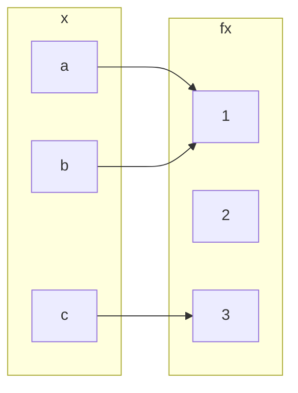

## Injective (one-to-one) Functions
Let $$f:A\rightarrow B$$ be a function. We call $$f$$ and injective, or one-to-one, function if:

$$f(a_1)=f(a_2)\Rightarrow a_1 = a_2 \text{ for all } a_1,a_2\in A$$

This is logically equivalent to $$a_1\neq a_2 \Rightarrow f(a_1) \neq f(a_2)$$ and so injective functions never repeat values. In other words:

Different inputs give different outputs.
{:.info}

### Example 1
$$f:\mathbb{Z}\rightarrow \mathbb{Z}$$ given by $$f(x)=x^2$$ is not injective.

$$h:\mathbb{Z}\rightarrow \mathbb{Z}$$ given by $$h(x)=2x$$ is injective.

### Example 2
To prove that a function is not injective you can give an individual example of a double mapping.

Take the following question foe the opposite:

$$h:\mathbb{Z}\rightarrow \mathbb{Z}$$ given by $$h(x)=2x$$ is injective.

#### Proof
Suppose for a proof by contradiction that there exist $$a_1,a_2$$ such that $$h(a_1=h(a_2)$$ and $$a_1\neq a_2$$.

$$2\times a_1 = 2a_2 \Rightarrow a_1 = a_2$$, a contradiction.

## Surjective (or onto) Functions
$$f:A\rightarrow B$$ is surjective, or onto, if the range of $$f$$ coincides with the co-domain $$f$$. This means that for every $$b\in B$$ there exists an $$a\in A$$ with $$b=f(a)$$.

### Examples
$$h:\mathbb{Z}\rightarrow \mathbb{Z}$$ given by $$h(x)=2x$$ is not surjective.

This is because you get every even values out as an answer.

$$h':\mathbb{Q}\rightarrow \mathbb{Q}$$ given by $$h'(x)=2x$$ is surjective.

This is as you can use rational numbers to make any other number when doubled.

## Question
Classify $$f:\{a,b,c\}\rightarrow\{1,2,3\}$$ given by:

* It is a function.
* Not injective, $$f(a)=f(b)=1$$
* Not subjective as no $$x$$ maps with $$f(x)=2$$.

## Bijections
We call $$f$$ bijective if $$f$$ is both injective and surjective.

### Examples
$$f:\mathbb{Q}\rightarrow \mathbb{Q}$$ given by $$f(x)=2x$$ is bijective.

## Inverse Functions
If $$f$$ is a bijection from a set $$X$$ to a set $$Y$$, then there is a function $$f^{-1}$$ from $$Y$$ to $$X$$ that undoes the action of $$f$$; that is, it sends each element of $$Y$$ back to the element of $$X$$ that it came from. This function is called the inverse function for $$f$$.

Then $$f(a)=b$$ if, and only if, $$f^{-1}(b)=a$$

### Example
$$k:\mathbb{R}\rightarrow \mathbb{R}$$ given by $$k(x)=4x+3$$ is invertible and $$k^{-1}(y)=\frac{1}{4}(y-3)$$. 

$$y=4x+3$$. So $$4x+3=y$$, $$4x=y-3$$, $$x = \frac{y-3}{4}$$

This proves the statement by giving the same value.
