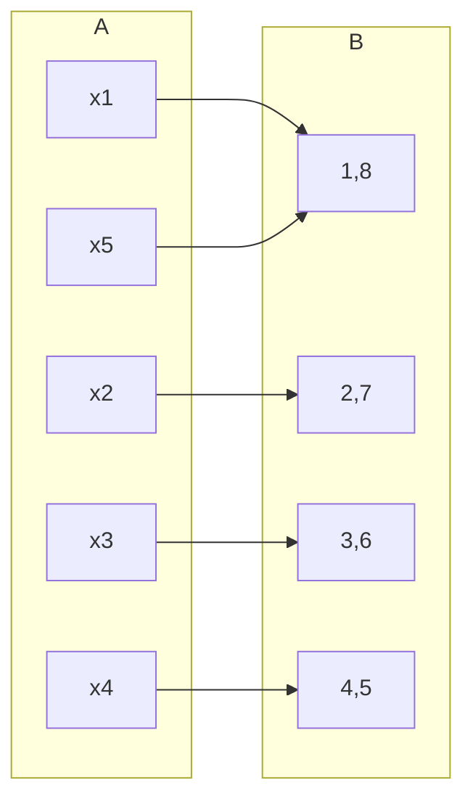

## Cardinality of Finite Sets and Functions
The cardinality of a finite set &#92;(S&#92;) is the number of elements in &#92;(S&#92;).

A bijection &#92;(f:S\rightarrow\{1,\ldots,n\}&#92;). This means that there are as many elements in the set that &#92;(S&#92;) maps to as there are in &#92;(S&#92;).

For finite sets &#92;(A&#92;) and &#92;(B&#92;):

* &#92;(\vert A\vert \geq\vert B\vert \Rightarrow&#92;) there is a surjective function from &#92;(A&#92;) to &#92;(B&#92;).
* &#92;(\vert A\vert \leq\vert B\vert \Rightarrow&#92;) there is an injective function from &#92;(A&#92;) to &#92;(B&#92;).
* &#92;(\vert A\vert =\vert B\vert \Rightarrow&#92;) there is a bijection function from &#92;(A&#92;) to &#92;(B&#92;).

```mermaid
graph TD
subgraph A
a[ ]
b[ ]
c[ ]
end
subgraph n
1
2
n
end
subgraph B
d[ ]
e[ ]
f[ ]
end
a --> 1
b --> 2
c --> n
d --> 1
e --> 2
f --> n
```

From the graph as &#92;(\vert A\vert =n=\vert B\vert&#92;) then we can deduce that &#92;(g^{-1}\circ f&#92;). 

* Bijective means one to one.
* Surjective means many to one.
* Injective means one to many.

## The Pigeonhole Principle
Let &#92;(f:A\rightarrow B&#92;) be a function where &#92;(A&#92;) and &#92;(B&#92;) are finite sets.

The pigeonhole principle states that if &#92;(\vert A\vert >\vert B\vert&#92;) then at least one value of &#92;(f&#92;) occurs more than once.

In other words, we have &#92;(f(a)=f(b)&#92;) for some distinct elements &#92;(a,b&#92;) of &#92;(A&#92;).

The principle is if &#92;((N+1)&#92;) pigeons occupy &#92;(N&#92;) holes, then some hole must have at least 2 pigeons.

### Example 1
There are 15 people on a bus. Show that at least two of them have a birthday in the same month of the year.

#### Proof
Let &#92;(A&#92;) be the set of all people on the bus. &#92;(\vert A\vert =15&#92;)

Let &#92;(B&#92;) be the set of months. &#92;(\vert B\vert =12&#92;)

&#92;(f&#92;) associates the month in which a person has been born with that person.

By the pigeonhole principle (PHP), at least two of them have a birthday on the same day.

### Example 2
How many different surnames must appear in a telephone directory to guarantee that at least two of the surnames begin with the same letter of the alphabet and end with the same letter of the alphabet?

If we are solving this by the pigeonhole principle then the set &#92;(A&#92;) of names must have same cardinality as &#92;(\vert B\vert +1&#92;) where &#92;(B&#92;) is the set of all pairs of letters. 

&#92;(\vert B\vert =26^2&#92;)

Therefore

&#92;(\vert B\vert +1=26^2+1&#92;)

### Example 3
Five number are selected from the numbers &#92;(1,2,3,4,5,6,7&#92;) and &#92;(8&#92;). Show that there will always be two of the numbers that sum to &#92;(9&#92;).

#### Proof

&#92;(\vert A\vert =5&#92;) and &#92;(\vert B\vert =4&#92;). If each element with &#92;(x_n&#92;) maps to the pair which contains its digit then there must be a pair with more than one mapping. This is to say that the two sets maps via a *surjective* function.

This proves that there will always be one pair in the list that sums to 9.
