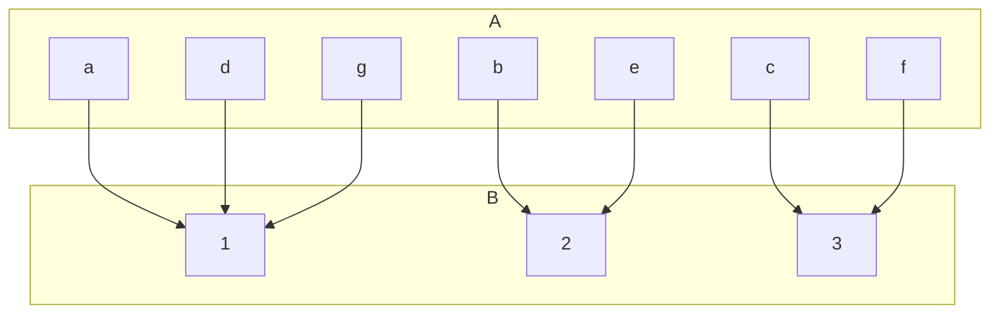
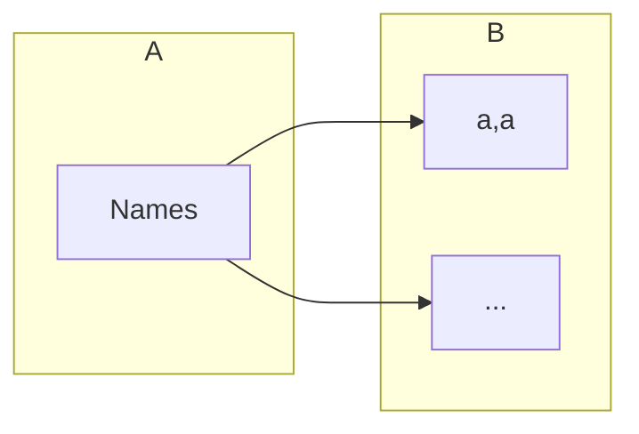

## Extended Pigeonhole Principle
Consider a function $f:A\rightarrow B\( where \)A\( and \)B\( are finite sets and \)\vert A\vert >k\vert B\vert \( for some natural number \)k\(. Then, there is a value of \)f\( which occurs at least \)k+1$ times.

In this graph \(k=2\). Additionally you can see that the value 1 occurs \(k+1=3\) times as \(a,d\) and \(g\) all map to it.

### Example
How many different surnames must appear in a telephone directory to guarantee that at least five of the surnames begin with the same letter of the alphabet and end with the same letter of the alphabet?

$\vert B\vert =26^2$

Therefore:

Due to the principles covered above, $\vert A\vert >4\vert B\vert $

Thus:

$\vert A\vert =4\times26\times26+1=2705$
