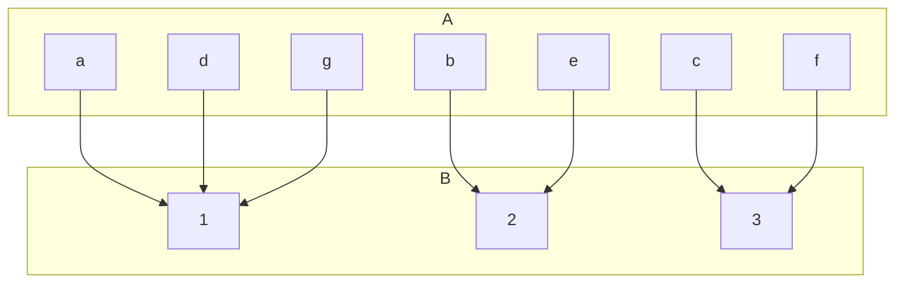
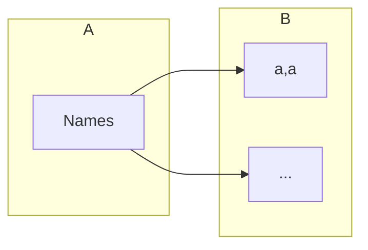

## Extended Pigeonhole Principle
Consider a function \(f:A\rightarrow B\) where \(A\) and \(B\) are finite sets and \(\vert A\vert >k\vert B\vert\) for some natural number \(k\). Then, there is a value of \(f\) which occurs at least \(k+1\) times.

In this graph \(k=2\). Additionally you can see that the value 1 occurs \(k+1=3\) times as \(a,d\) and \(g\) all map to it.

### Example
How many different surnames must appear in a telephone directory to guarantee that at least five of the surnames begin with the same letter of the alphabet and end with the same letter of the alphabet?

\(\vert B\vert =26^2\)

Therefore:

Due to the principles covered above, \(\vert A\vert >4\vert B\vert \)

Thus:

\(\vert A\vert =4\times26\times26+1=2705\)
