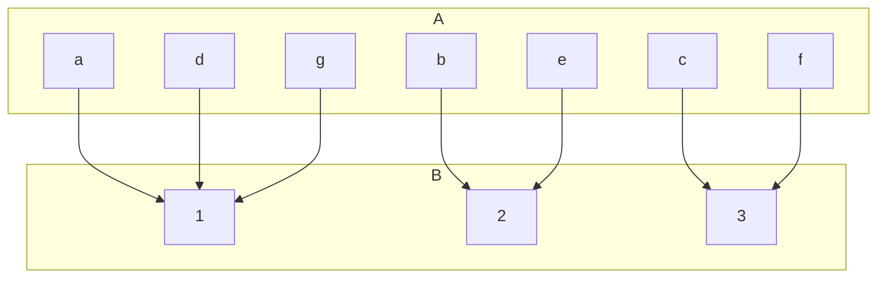
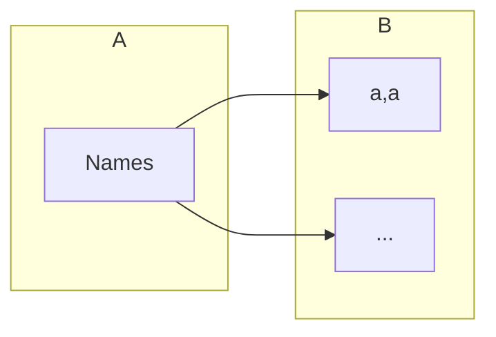

## Extended Pigeonhole Principle
Consider a function &#92;(f:A&#92;rightarrow B&#92;) where &#92;(A&#92;) and &#92;(B&#92;) are finite sets and &#92;(&#92;vert A&#92;vert >k&#92;vert B&#92;vert&#92;) for some natural number &#92;(k&#92;). Then, there is a value of &#92;(f&#92;) which occurs at least &#92;(k+1&#92;) times.

In this graph &#92;(k=2&#92;). Additionally you can see that the value 1 occurs &#92;(k+1=3&#92;) times as &#92;(a,d&#92;) and &#92;(g&#92;) all map to it.

### Example
How many different surnames must appear in a telephone directory to guarantee that at least five of the surnames begin with the same letter of the alphabet and end with the same letter of the alphabet?

&#92;(&#92;vert B&#92;vert =26^2&#92;)

Therefore:

Due to the principles covered above, &#92;(&#92;vert A&#92;vert >4&#92;vert B&#92;vert &#92;)

Thus:

&#92;(&#92;vert A&#92;vert =4&#92;times26&#92;times26+1=2705&#92;)
