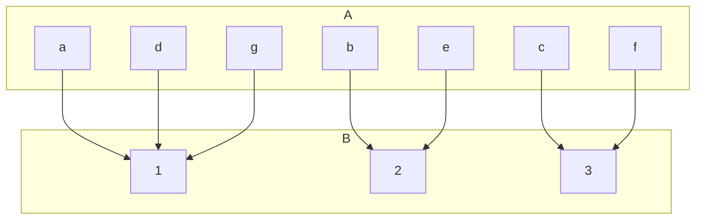
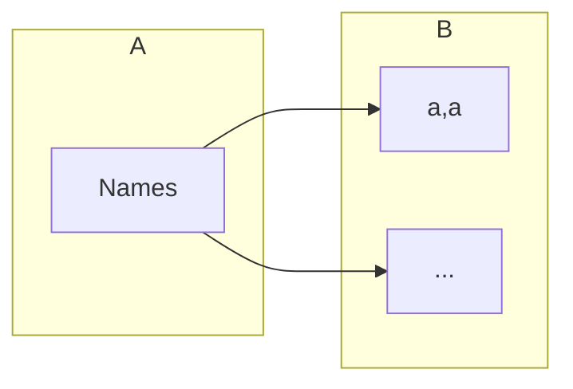

## Extended Pigeonhole Principle
Consider a function <pre>\(f:A\rightarrow B\)</pre> where <pre>\(A\)</pre> and <pre>\(B\)</pre> are finite sets and <pre>\(\vert A\vert >k\vert B\vert\)</pre> for some natural number <pre>\(k\)</pre>. Then, there is a value of <pre>\(f\)</pre> which occurs at least <pre>\(k+1\)</pre> times.

In this graph <pre>\(k=2\)</pre>. Additionally you can see that the value 1 occurs <pre>\(k+1=3\)</pre> times as <pre>\(a,d\)</pre> and <pre>\(g\)</pre> all map to it.

### Example
How many different surnames must appear in a telephone directory to guarantee that at least five of the surnames begin with the same letter of the alphabet and end with the same letter of the alphabet?

<pre>\(\vert B\vert =26^2\)</pre>

Therefore:

Due to the principles covered above, <pre>\(\vert A\vert >4\vert B\vert \)</pre>

Thus:

<pre>\(\vert A\vert =4\times26\times26+1=2705\)</pre>
