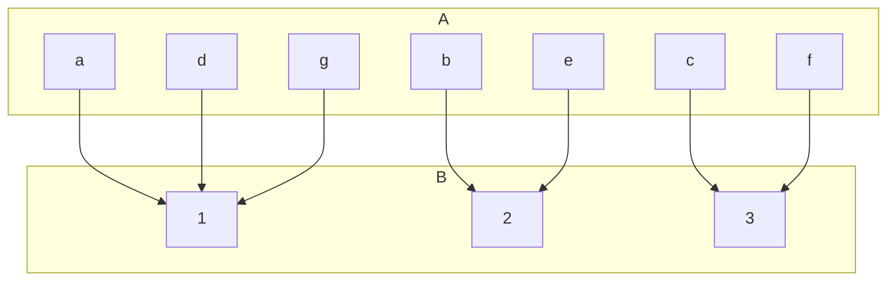
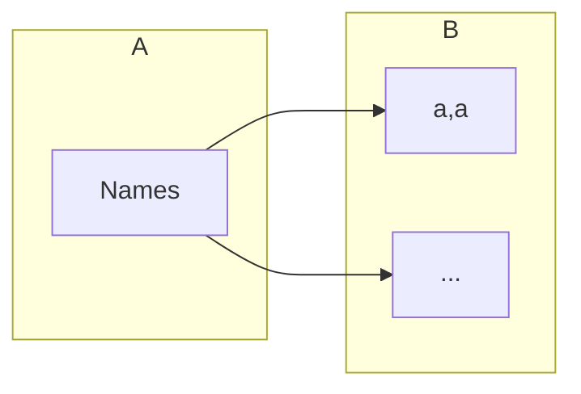

## Extended Pigeonhole Principle
Consider a function <![CDATA[\(f:A\rightarrow B\)]]> where <![CDATA[\(A\)]]> and <![CDATA[\(B\)]]> are finite sets and <![CDATA[\(\vert A\vert >k\vert B\vert\)]]> for some natural number <![CDATA[\(k\)]]>. Then, there is a value of <![CDATA[\(f\)]]> which occurs at least <![CDATA[\(k+1\)]]> times.

In this graph <![CDATA[\(k=2\)]]>. Additionally you can see that the value 1 occurs <![CDATA[\(k+1=3\)]]> times as <![CDATA[\(a,d\)]]> and <![CDATA[\(g\)]]> all map to it.

### Example
How many different surnames must appear in a telephone directory to guarantee that at least five of the surnames begin with the same letter of the alphabet and end with the same letter of the alphabet?

<![CDATA[\(\vert B\vert =26^2\)]]>

Therefore:

Due to the principles covered above, <![CDATA[\(\vert A\vert >4\vert B\vert \)]]>

Thus:

<![CDATA[\(\vert A\vert =4\times26\times26+1=2705\)]]>
