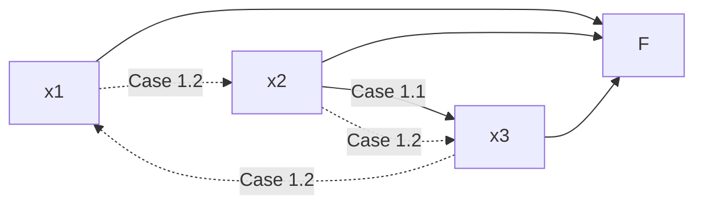
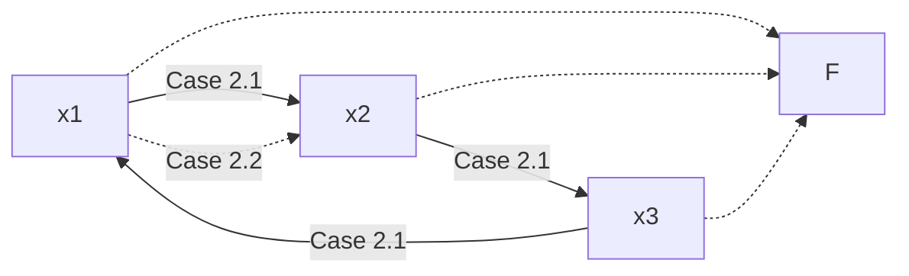

## Theorem of Friends and Strangers
Show that in any group of six people there are either three who all know each other or three complete strangers.


On this graph blue is people who know each other and red is people who don't. From the graph you can see that only two people will know each other.


What the question is saying is that no matter how you colour this you will always have a triangle of three people with red lines (don't know) or blue lines (do know).

### Proof
Let <pre>\(A,B,C,D,E,\underline F\)</pre> denote people under consideration.

Construct <pre>\(f:\{A,B,C,D,E\}\rightarrow\{0,1\}\)</pre> as follows: <pre>\(f(x)=1\)</pre> if <pre>\(x\)</pre> knows <pre>\(F\)</pre>, or <pre>\(0\)</pre> else. 

This means that we are taking out the person <pre>\(F\)</pre> and considering who they know in a binary format.

```mermaid
graph TD
subgraph A
A
B
C
D
E
end
subgraph B
0
1
end
```

<pre>\(\vert A\vert =5, \vert B\vert =2\)</pre> Therefore there must exist <pre>\(\{x_1,x_2,x_3\}\subseteq\{A,B,C,D,E\}\)</pre> such that <pre>\(f(x_1)=f(x_2)=f(x_3)\)</pre>

#### Case 1
Suppose that <pre>\(f(x_1)=f(x_2)=f(x_3)=1\)</pre>. This means that they all know each other.


*Dotted means don't know.*

##### Case 1.1
There is a pair who know each other.

#### Case 1.2
There is no pair who know each other. 

So <pre>\(x_1,x_2,x_3\)</pre> are complete strangers.

### Case 2
<pre>\(f(x_1)=f(x_2)=f(x_3)=0\)</pre>


*Dotted means don't know.*

#### Case 2.1
<pre>\(x_1,x_2,x_3\)</pre> all know each other.

#### Case 2.2
Three is a pair who don't know each other.

As you can see in any case there is a triangle of three people with links stating that they know or don't know each other in any case. This proves the statement. This is as we can see that three know or don't know each other in any situation.
