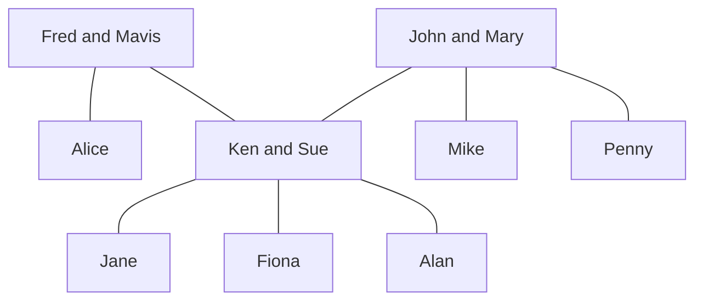

## Cartesian Product
For the Cartesian product you are making a list of all possibilities of the elements in both sets. This is similar to multiplying brackets.

### Example
Let &#92;(A=\{1,2\}&#92;) and &#92;(B=\{a,b,c\}&#92;), then:

&#92;[A\times B = \{(1,a),(2,a),(1,b),(2,b),(1,c),(2,c)\}&#92;]

Therefore:

&#92;[B\times A = \{(a,1),(a,2),(b,1),(b,2),(c,1),(c,2)\}&#92;]

### Relations
Any relation between the elements in set &#92;(A&#92;) and &#92;(B&#92;) will be in the set of their Cartesian product.

A **binary relation** between two sets &#92;(A&#92;) and &#92;(B&#92;) is a subset &#92;(R&#92;) of the Cartesian product &#92;(A\times B&#92;).

If &#92;(A=B&#92;), then &#92;(R&#92;) is called **a binary relation on &#92;(A&#92;)**.

### Family Tree Example
The set &#92;(A&#92;) is the set of all people in the tree.

1. &#92;(R=\{(x,y)\vert x\text{ is a grandfather of } y\}&#92;)

	For this set:

	&#92;(R=\{\text{(Fred, Jane), (Fred, Fiona), (Fred, Alan), (John, Jayne), (John, Fiona), (John, Alan)}\}&#92;)

2. &#92;(S=\{(x,y)\vert x\text{ is a sister of } y\}&#92;)

	For this set:

	&#92;(S=\{\text{(Alice, Ken), (Sue, Mike), (Sue, Penny), (Penny, Sue), (Penny, Mike), (Jane, Fiona)}\}&#92;)

### Algebraic Example
Write down the ordered parts belonging to the following binary relations between &#92;(A=\{1,3,5,7\}&#92;) and &#92;(B=\{2,4,6\}:&#92;)

1. &#92;(U=\{(x,y)\in A\times B \vert x + y = 9\}&#92;)

	This means the combinations from the two sets where the elements sum to 9.

	&#92;(U=\{(3,6),(5,4),(7,2)\}&#92;)

2. &#92;(V=\{(x,y)\in A\times B \vert x < y \}&#92;)

	This is the set of all pairs such that the first element is smaller than the second element.

	&#92;(V=\{(1,2),(1,4),(1,6),(3,4),(3,6),(5,6)\}&#92;)
