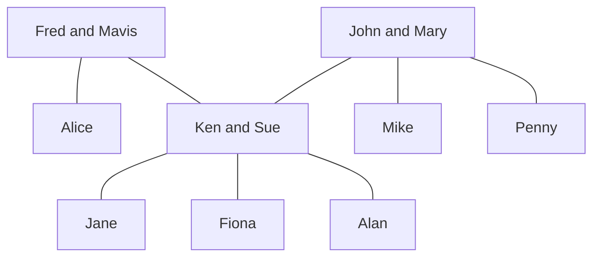

## Cartesian Product
For the Cartesian product you are making a list of all possibilities of the elements in both sets. This is similar to multiplying brackets.

### Example
Let $A=\\{1,2\\}$ and $B=\\{a,b,c\\}$, then:

$$A\times B = \\{(1,a),(2,a),(1,b),(2,b),(1,c),(2,c)\\}$$

Therefore:

$$B\times A = \\{(a,1),(a,2),(b,1),(b,2),(c,1),(c,2)\\}$$

### Relations
Any relation between the elements in set $A$ and $B$ will be in the set of their Cartesian product.

A **binary relation** between two sets $A$ and $B$ is a subset $R$ of the Cartesian product $A\times B$.

If $A=B$, then $R$ is called **a binary relation on $A$**.

### Family Tree Example
The set $A$ is the set of all people in the tree.

1. $R=\\{(x,y)\vert x\text{ is a grandfather of } y\\}$

	For this set:

	$R=\\{\text{(Fred, Jane), (Fred, Fiona), (Fred, Alan), (John, Jayne), (John, Fiona), (John, Alan)}\\}$

2. $S=\\{(x,y)\vert x\text{ is a sister of } y\\}$

	For this set:

	$S=\\{\text{(Alice, Ken), (Sue, Mike), (Sue, Penny), (Penny, Sue), (Penny, Mike), (Jane, Fiona)}\\}$

### Algebraic Example
Write down the ordered parts belonging to the following binary relations between $A=\\{1,3,5,7\\}$ and $B=\\{2,4,6\\}$:

1. $U=\\{(x,y)\in A\times B \vert x + y = 9\\}$

	This means the combinations from the two sets where the elements sum to 9.

	$U=\\{(3,6),(5,4),(7,2)\\}$

2. $V=\\{(x,y)\in A\times B \vert x < y \\}$

	This is the set of all pairs such that the first element is smaller than the second element.

	$V=\\{(1,2),(1,4),(1,6),(3,4),(3,6),(5,6)\\}$
