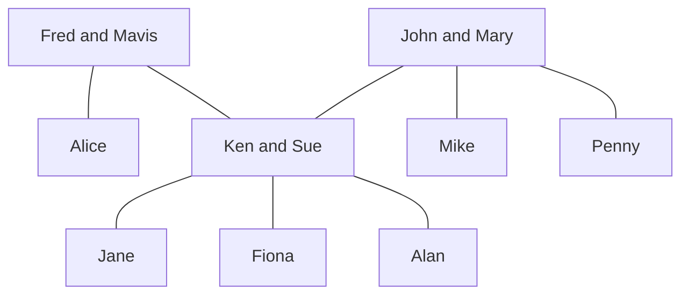

## Cartesian Product
For the Cartesian product you are making a list of all possibilities of the elements in both sets. This is similar to multiplying brackets.

### Example
Let <pre>\(A=\{1,2\}\)</pre> and <pre>\(B=\{a,b,c\}\)</pre>, then:

<pre>\[A\times B = \{(1,a),(2,a),(1,b),(2,b),(1,c),(2,c)\}\]</pre>

Therefore:

<pre>\[B\times A = \{(a,1),(a,2),(b,1),(b,2),(c,1),(c,2)\}\]</pre>

### Relations
Any relation between the elements in set <pre>\(A\)</pre> and <pre>\(B\)</pre> will be in the set of their Cartesian product.

A **binary relation** between two sets <pre>\(A\)</pre> and <pre>\(B\)</pre> is a subset <pre>\(R\)</pre> of the Cartesian product <pre>\(A\times B\)</pre>.

If <pre>\(A=B\)</pre>, then <pre>\(R\)</pre> is called **a binary relation on <pre>\(A\)</pre>**.

### Family Tree Example
The set <pre>\(A\)</pre> is the set of all people in the tree.

1. <pre>\(R=\{(x,y)\vert x\text{ is a grandfather of } y\}\)</pre>

	For this set:

	<pre>\(R=\{\text{(Fred, Jane), (Fred, Fiona), (Fred, Alan), (John, Jayne), (John, Fiona), (John, Alan)}\}\)</pre>

2. <pre>\(S=\{(x,y)\vert x\text{ is a sister of } y\}\)</pre>

	For this set:

	<pre>\(S=\{\text{(Alice, Ken), (Sue, Mike), (Sue, Penny), (Penny, Sue), (Penny, Mike), (Jane, Fiona)}\}\)</pre>

### Algebraic Example
Write down the ordered parts belonging to the following binary relations between <pre>\(A=\{1,3,5,7\}\)</pre> and <pre>\(B=\{2,4,6\}:\)</pre>

1. <pre>\(U=\{(x,y)\in A\times B \vert x + y = 9\}\)</pre>

	This means the combinations from the two sets where the elements sum to 9.

	<pre>\(U=\{(3,6),(5,4),(7,2)\}\)</pre>

2. <pre>\(V=\{(x,y)\in A\times B \vert x < y \}\)</pre>

	This is the set of all pairs such that the first element is smaller than the second element.

	<pre>\(V=\{(1,2),(1,4),(1,6),(3,4),(3,6),(5,6)\}\)</pre>
