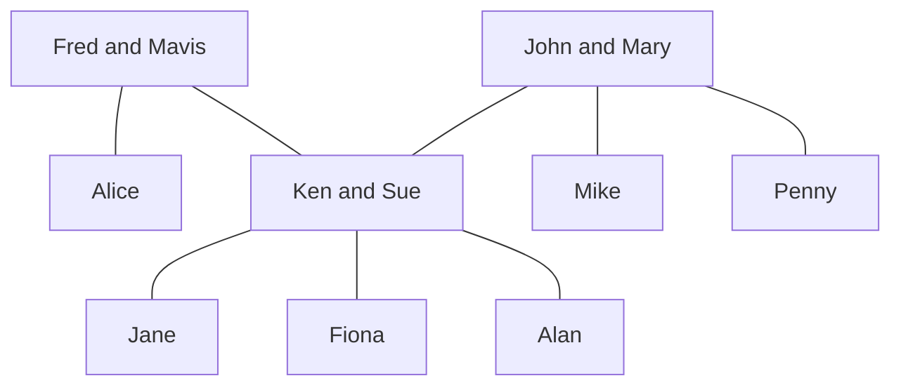

## Cartesian Product
For the Cartesian product you are making a list of all possibilities of the elements in both sets. This is similar to multiplying brackets.

### Example
Let \(A=\{1,2\}\) and \(B=\{a,b,c\}\), then:

\[A\times B = \{(1,a),(2,a),(1,b),(2,b),(1,c),(2,c)\}\]

Therefore:

\[B\times A = \{(a,1),(a,2),(b,1),(b,2),(c,1),(c,2)\}\]

### Relations
Any relation between the elements in set \(A\) and \(B\) will be in the set of their Cartesian product.

A **binary relation** between two sets \(A\) and \(B\) is a subset \(R\) of the Cartesian product \(A\times B\).

If \(A=B\), then \(R\) is called **a binary relation on \(A\)**.

### Family Tree Example
The set \(A\) is the set of all people in the tree.

1. \(R=\{(x,y)\vert x\text{ is a grandfather of } y\}\)

	For this set:

	\(R=\{\text{(Fred, Jane), (Fred, Fiona), (Fred, Alan), (John, Jayne), (John, Fiona), (John, Alan)}\}\)

2. \(S=\{(x,y)\vert x\text{ is a sister of } y\}\)

	For this set:

	\(S=\{\text{(Alice, Ken), (Sue, Mike), (Sue, Penny), (Penny, Sue), (Penny, Mike), (Jane, Fiona)}\}\)

### Algebraic Example
Write down the ordered parts belonging to the following binary relations between \(A=\{1,3,5,7\}\) and \(B=\{2,4,6\}:\)

1. \(U=\{(x,y)\in A\times B \vert x + y = 9\}\)

	This means the combinations from the two sets where the elements sum to 9.

	\(U=\{(3,6),(5,4),(7,2)\}\)

2. \(V=\{(x,y)\in A\times B \vert x < y \}\)

	This is the set of all pairs such that the first element is smaller than the second element.

	\(V=\{(1,2),(1,4),(1,6),(3,4),(3,6),(5,6)\}\)
