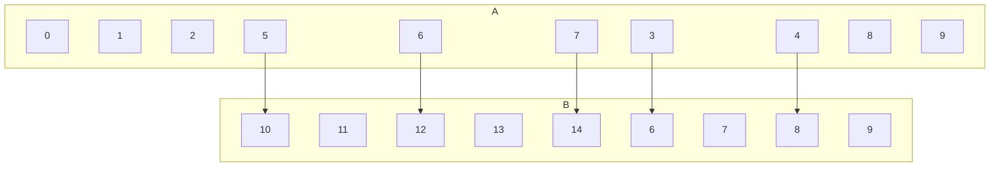

## Digraph Representation of Relations

Recall that a function <pre>\(f\)</pre> from a set <pre>\(A\)</pre> to a set <pre>\(B\)</pre> assigns exactly one element of <pre>\(B\)</pre> to each element of <pre>\(A\)</pre>.

* Gives rise to the relation <pre>\(R_f=\{(a,b)\in A\times B \vert b =f(a)\}\)</pre>

If a relation <pre>\(S\subseteq A\times B\)</pre> is such that for every <pre>\(a\in A\)</pre> there exists at most one <pre>\(b\in B\)</pre> with <pre>\((a,b)\in S\)</pre>, relation <pre>\(S\)</pre> is **functional**.

Sometimes in the literature, functions are introduces through functional relations.

### Example
<pre>\(A\{i\in \Bbb{N}\vert i<10\},B=\{i\in\Bbb{N}\vert 5<i<15\},R=\{((x,y)\in A\times B\vert y =2x)\}\)</pre>

As this is a relation there are allowed to be values in the set <pre>\(A\)</pre> which don't have a mapping to a value in the set <pre>\(B\)</pre>. If this was a function and not a relation that wouldn't be allowed.
{:.info}

This is a functional relation as each item in  <pre>\(A\)</pre> only has **one** mapping to <pre>\(B\)</pre>.
{:.info}
