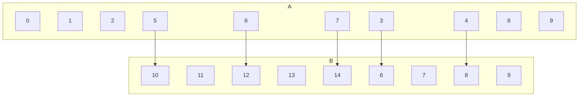

## Digraph Representation of Relations

Recall that a function \(f\) from a set \(A\) to a set \(B\) assigns exactly one element of \(B\) to each element of \(A\).

* Gives rise to the relation $R_f=\{(a,b)\in A\times B \vert b =f(a)\}$

If a relation $S\subseteq A\times B\( is such that for every \)a\in A\( there exists at most one \)b\in B\( with \)(a,b)\in S\(, relation \)S$ is **functional**.

Sometimes in the literature, functions are introduces through functional relations.

### Example
$A\{i\in \Bbb{N}\vert i<10\},B=\{i\in\Bbb{N}\vert 5<i<15\},R=\{((x,y)\in A\times B\vert y =2x)\}$

As this is a relation there are allowed to be values in the set \(A\) which don't have a mapping to a value in the set \(B\). If this was a function and not a relation that wouldn't be allowed.
{:.info}

This is a functional relation as each item in  \(A\) only has **one** mapping to \(B\).
{:.info}
