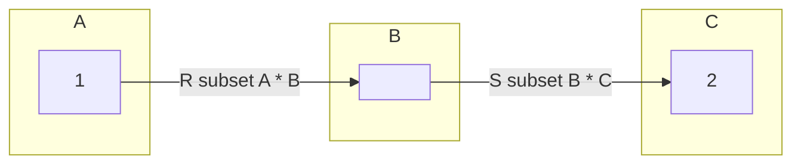
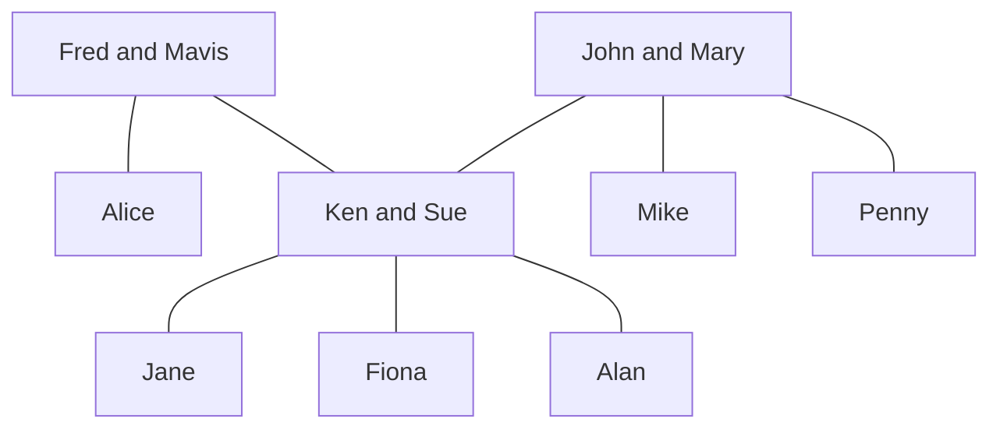
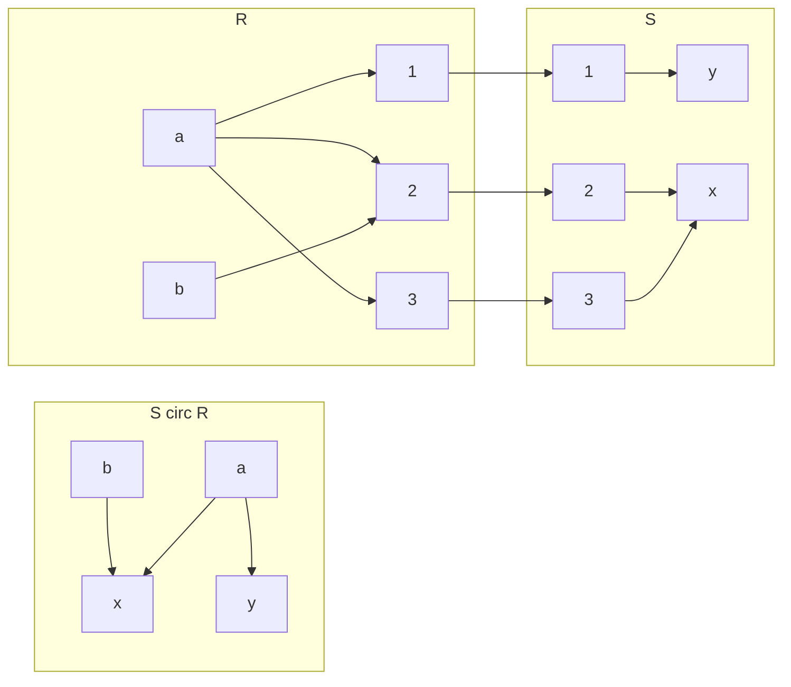
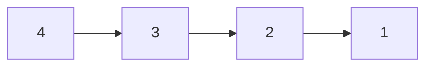
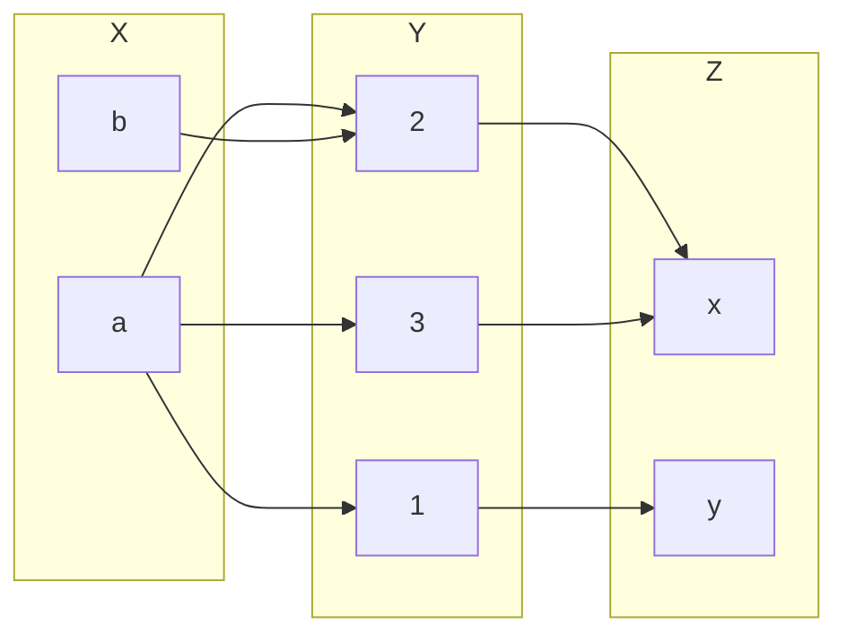
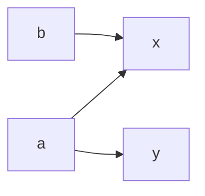

## Building New Relations from Given Ones
### Inverse Relation
Given a realtion \#92;(R\#92;subseteq A \#92;times B\#92;). We define the inverse relation \#92;(R^{-1}\#92;subset B\#92;times A\#92;) by:

\#92;[R^{-1}=\#92;{(b,a)\#92;vert (a,b) \#92;in R\#92;}\#92;]

Example:

* The inverse of the relation *is a parent of* on the set of people is the relation *is a child of*.

In other words if you swap the elements of a given relation you should get the inverse relation.

#### Example
\#92;(A=\#92;{1,2,3,4\#92;},R=\#92;{(x,y)\#92;vert x\#92;leq y\#92;}\#92;)

Therefore: 

\#92;(R=\#92;{(1,1),(1,2),(1,3),(1,4),(2,2),(2,3),(2,4),(3,3),(3,4),(4,4)\#92;}\#92;)

And:

\#92;(R=\#92;{(1,1),(2,1),(3,1),(4,1),(2,2),(3,2),(4,2),(3,3),(4,3),(4,4)\#92;}\#92;)

You could also say:

\#92;(R^{-1}=\#92;{(y,x)\#92;vert x \#92;leq y\#92;} = \#92;{(u,v)\#92;vert u\#92;geq v\#92;}\#92;)

In these examples you either swap the predicate to denote the inverse or you swap the evaluation such that it produces the inverse.

### Composition of Relations
Let \#92;(R\#92;subseteq A\#92;times b\#92;) and \#92;(s\#92;subseteq B\#92;times C\#92;). The (functional) composition of \#92;(R\#92;) and \#92;(S\#92;), denoted by \#92;(S\#92;circ R\#92;), is the binary relation between \#92;(A\#92;) and \#92;(C\#92;) given by:

\#92;[S\#92;circ R = \#92;{(a,c)\#92;vert \#92;text{ exists } b\#92;in B \#92;text{ such that } aRb \#92;text{ and } bSc\#92;}\#92;]

The notation \#92;(aRb\#92;) is another way of writing \#92;((a,b)\#92;in R\#92;).
{:.info}

Example:

* If \#92;(R\#92;) is the relation *is a sister of* and \#92;(S\#92;) is the relation *is a parent of* then:
	* \#92;(S\#92;circ R\#92;) is the relation *is an aunt of*.
	* \#92;(S\#92;circ S\#92;) is the relation *is a grandparent of*.
	
#### Example

* \#92;(R:\#92;) is a sister of
* \#92;(S:\#92;) is a parent of
* \#92;(S\#92;circ R=\#92;{(a,c)\#92;vert\#92;text{ exists } b\#92;in B\#92;text{ such that } aRb \#92;text{ and } bSc\#92;}\#92;)

* Alice \#92;(R\#92;) Ken and Ken \#92;(S\#92;) Alan so Alice \#92;(S\#92;circ R\#92;) Alan.
	* This can also be written as \#92;((\#92;text{Alice, Alan})\#92;in S\#92;circ R\#92;)
	
#### Diagraph Representation of Compositions

For this diagram \#92;(A=\#92;{a,b\#92;},B=\#92;{1,2,3\#92;},C=\#92;{x,y\#92;}\#92;):

## Computer Friendly Representation of Binary Relations - Matrices

Let \#92;(A=\#92;{a_1,\#92;ldots,a_n\#92;},B=\#92;{b_1,\#92;ldots,b_m\#92;}\#92;) and \#92;(R\#92;subseteq A\#92;times B\#92;).

We represent \#92;(R\#92;) by an array \#92;(M\#92;) of \#92;(n\#92;) rows and \#92;(m\#92;) columns. Such an array is called an \#92;(n\#92;) by \#92;(m\#92;) matrix.

The entry in row \#92;(i\#92;) and column \#92;(j\#92;) of this matrix is given by \#92;(M(i,j)\#92;) where:

\#92;[
M(i,j)=\#92;begin{cases}
1 & \#92;text{ if } (a_i,b_j)\#92;in R\#92;\#92;
0 & \#92;text{ if } (a_1,b_j)\#92;notin R
\#92;end{cases}
\#92;]

### Example 1
Let \#92;(A=\#92;{1,3,5,7\#92;}, B=\#92;{2,4,6\#92;}\#92;) and:

\#92;[U=\#92;{(x,y)\#92;in A\#92;times B\#92;vert x + y = 9\#92;}\#92;]

Assume an enumeration \#92;(a_1=1,a_2=3,a_3=5,a_4=7\#92;) and \#92;(b_1=2,b_2=4,b_3=6\#92;). Then \#92;(M\#92;) represents \#92;(U\#92;), where:

\#92;[
M = \#92;begin{bmatrix}
0 & 0 & 0\#92;\#92;
0 & 0 & 1\#92;\#92;
0 & 1 & 0\#92;\#92;
1 & 0 & 0
\#92;end{bmatrix}
\#92;]

When representing in a matrix the rows are the items in set \#92;(A\#92;) going down and the columns are the items in set \#92;(B\#92;) going across.
{:.info}

You can then read the answers from the matrix as: \#92;(U=\#92;{(7,2),(5,4),(4,6)\#92;}\#92;).

### Example 2
The binary relation \#92;(R\#92;) on \#92;(A=\#92;{1,2,3,4\#92;}\#92;) has the following digraph representation:

1. What are the ordered pairs?
	
	\#92;(R=\#92;{(4,3),(3,2),(2,1)\#92;}\#92;)
1. Draw the matrix.
	
	\#92;[
	\#92;begin{bmatrix}
	0&0&0&0\#92;\#92;
	1&0&0&0\#92;\#92;
	0&1&0&0\#92;\#92;
	0&0&1&0
	\#92;end{bmatrix}
	\#92;]
1. Explain the relation.

	\#92;(x\#92;) is 1 larger than \#92;(y\#92;).

### Matrices and Composition
This is working on the same relation as was seen in the section [Diagraph Representation of Compositions](#diagraph-representation-of-compositions).

This result in the following for the composition of \#92;(S\#92;circ R\#92;):

From these graphs we can deduce that \#92;(R\#92;subseteq X\#92;times Y, S\#92;subseteq Y\#92;times Z\#92;).

Given the matrices of \#92;(R\#92;) and \#92;(S\#92;):

\#92;[
R: \#92;begin{bmatrix}
1&1&1\#92;\#92;
0&1&0
\#92;end{bmatrix}
S: \#92;begin{bmatrix}
0&1\#92;\#92;
1&0\#92;\#92;
1&0
\#92;end{bmatrix}
\#92;]

Calculate the binary relation matrix of \#92;(S\#92;circ R\#92;):

If you transpose the row \#92;(a\#92;) in the matrix \#92;(R\#92;) on the column \#92;(x\#92;) in the matrix \#92;(S\#92;) you can compare to see of \#92;(a\#92;) is a subset of \#92;(y\#92;). If it is then you put a 1 in the resultant matrix and if not you put a zero:

\#92;[
S\#92;circ R:\#92;begin{bmatrix}
1&1\#92;\#92;
1&0
\#92;end{bmatrix}
\#92;]

#### Boolean Matrix Product
Given two matrices with entries 1 and 0 representing the relations we can form the matrix representing the composition. This is called the logical (Boolean) matrix product.

Let \#92;(A=\#92;{a_1,\#92;ldots,a_n\#92;},B=\#92;{b_1,\#92;ldots,b_m\#92;}\#92;) and \#92;(C=\#92;{c_1,\#92;ldots,c_p\#92;}\#92;).

The logical matrix \#92;(M\#92;) representing \#92;(R\#92;) is given by:

\#92;[
M(i,j)=\#92;begin{cases}
1 & \#92;text{ if } (a_i,b_j)\#92;in R\#92;\#92;
0 & \#92;text{ if } (a_1,b_j)\#92;notin R
\#92;end{cases}
\#92;]

The logical matrix \#92;(N\#92;) representing \#92;(S\#92;) is given by:

\#92;[
N(i,j)=\#92;begin{cases}
1 & \#92;text{ if } (b_i,c_j)\#92;in S\#92;\#92;
0 & \#92;text{ if } (b_1,c_j)\#92;notin S
\#92;end{cases}
\#92;]

Then the entries \#92;(P(i,)\#92;) of the logical matrix \#92;(P\#92;) representing \#92;(S\#92;circ R\#92;) are given by:

* \#92;(P(i,j)=1\#92;) if there existsw \#92;(l\#92;) with \#92;(1\#92;leq l\#92;leq m\#92;) such that \#92;(M(i,l)=1\#92;) and \#92;(N(i,j)=1\#92;).
* \#92;(P(i,j)=0\#92;), otherwise.

This is the same as a product of matrices, \#92;(P=MN\#92;). Instead of addition and multiplication we use logical OR and AND.
