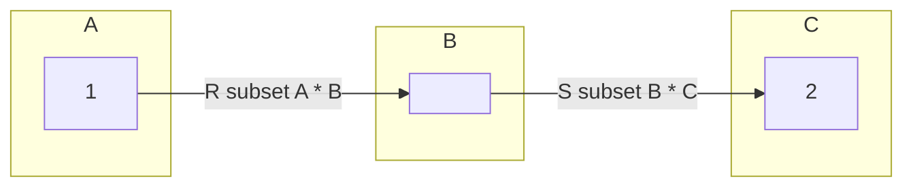
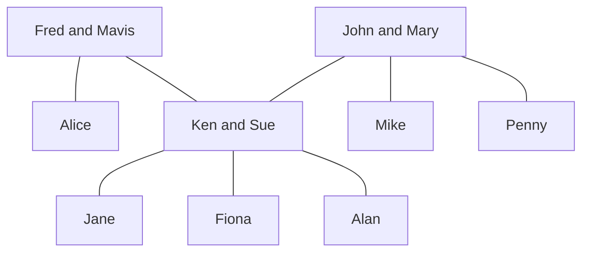
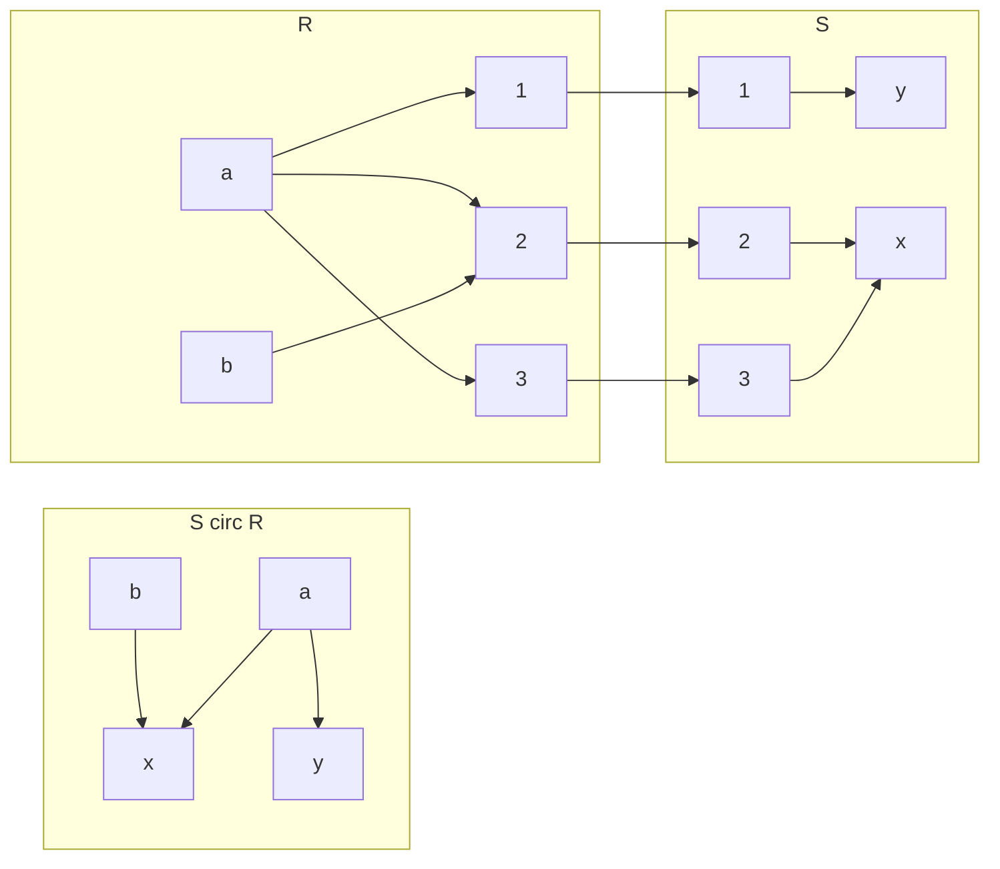
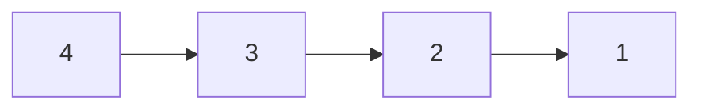
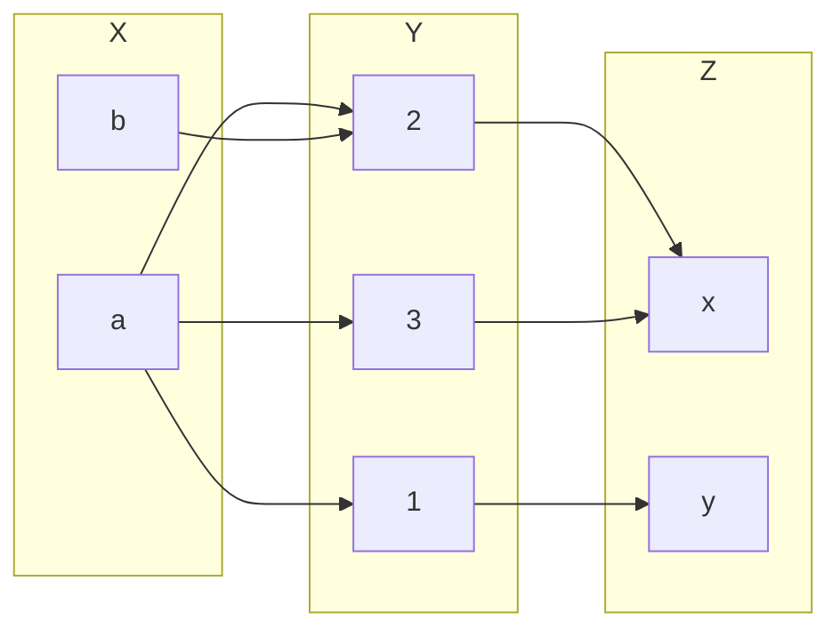
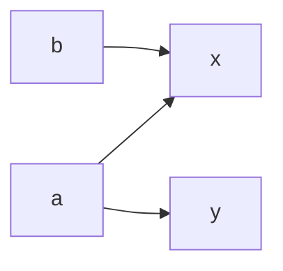

## Building New Relations from Given Ones
### Inverse Relation
Given a realtion \(R\subseteq A \times B\). we define the inverse relation \(R^{-1}\subset B\times A\) by:

\]R^{-1}=\{(b,a)\vert (a,b) \in R\}\]

Example:

* The inverse of the relation *is a parent of* on the set of people is the relation *is a child of*.

In other words if you swap the elements of a given relation you should get the inverse relation.

#### Example
\(A=\{1,2,3,4\},R=\{(x,y)\vert x\leq y\}\)

Therefore: 

\(R=\{(1,1),(1,2),(1,3),(1,4),(2,2),(2,3),(2,4),(3,3),(3,4),(4,4)\}\)

And:

\(R=\{(1,1),(2,1),(3,1),(4,1),(2,2),(3,2),(4,2),(3,3),(4,3),(4,4)\}\)

You could also say:

\(R^{-1}=\{(y,x)\vert x \leq y\} = \{(u,v)\vert u\geq v\}\)

In these examples you either swap the predicate to denote the inverse or you swap the evaluation such that it produces the inverse.

### Composition of Relations
Let \(R\subseteq A\times b\) and \(s\subseteq B\times C\). The (functional) composition of \(R\) and \(S\), denoted by \(S\circ R\), is the binary relation between \(A\) and \(C\) given by:

\]S\circ R = \{(a,c)\vert \text{ exists } b\in B \text{ such that } aRb \text{ and } bSc\}\]

The notation \(aRb\) is another way of writing \((a,b)\in R\).
{:.info}

Example:

* If \(R\) is the relation *is a sister of* and \(S\) is the relation *is a parent of* then:
	* \(S\circ R\) is the relation *is an aunt of*.
	* \(S\circ S\) is the relation *is a grandparent of*.
	
#### Example

* \(R:\) is a sister of
* \(S:\) is a parent of
* \(S\circ R=\{(a,c)\vert\text{ exists } b\in B\text{ such that } aRb \text{ and } bSc\}\)

* Alice \(R\) Ken and Ken \(S\) Alan so Alice \(S\circ R\) Alan.
	* This can also be written as \((\text{Alice, Alan})\in S\circ R\)
	
#### Diagraph Representation of Compositions

For this diagram \(A=\{a,b\},B=\{1,2,3\},C=\{x,y\}\):

## Computer Friendly Representation of Binary Relations - Matrices

Let \(A=\{a_1,\ldots,a_n\},B=\{b_1,\ldots,b_m\}\) and \(R\subseteq A\times B\).

We represent \(R\) by an array \(M\) of \(n\) rows and \(m\) columns. Such an array is called an \(n\) by \(m\) matrix.

The entry in row \(i\) and column \(j\) of this matrix is given by \(M(i,j)\) where:

\]
M(i,j)=\begin{cases}
1 & \text{ if } (a_i,b_j)\in R\\
0 & \text{ if } (a_1,b_j)\notin R
\end{cases}
\]

### Example 1
Let \(A=\{1,3,5,7\}, B=\{2,4,6\}\) and:

\]U=\{(x,y)\in A\times B\vert x + y = 9\}\]

Assume an enumeration \(a_1=1,a_2=3,a_3=5,a_4=7\) and \(b_1=2,b_2=4,b_3=6\). Then \(M\) represents \(U\), where:

\]
M = \begin{bmatrix}
0 & 0 & 0\\
0 & 0 & 1\\
0 & 1 & 0\\
1 & 0 & 0
\end{bmatrix}
\]

When representing in a matrix the rows are the items in set \(A\) going down and the columns are the items in set \(B\) going across.
{:.info}

You can then read the answers from the matrix as: \(U=\{(7,2),(5,4),(4,6)\}\).

### Example 2
The binary relation \(R\) on \(A=\{1,2,3,4\}\) has the following digraph representation:

1. What are the ordered pairs?
	
	\(R=\{(4,3),(3,2),(2,1)\}\)
1. Draw the matrix.
	
	\]
	\begin{bmatrix}
	0&0&0&0\\
	1&0&0&0\\
	0&1&0&0\\
	0&0&1&0
	\end{bmatrix}
	\]
1. Explain the relation.

	\(x\) is 1 larger than \(y\).

### Matrices and Composition
This is working on the same relation as was seen in the section [Diagraph Representation of Compositions](#diagraph-representation-of-compositions).

This result in the following for the composition of \(S\circ R\):

From these graphs we can deduce that \(R\subseteq X\times Y, S\subseteq Y\times Z\).

Given the matrices of \(R\) and \(S\):

\]
R: \begin{bmatrix}
1&1&1\\
0&1&0
\end{bmatrix}
S: \begin{bmatrix}
0&1\\
1&0\\
1&0
\end{bmatrix}
\]

Calculate the binary relation matrix of \(S\circ R\):

If you transpose the row \(a\) in the matrix \(R\) on the column \(x\) in the matrix \(S\) you can compare to see of \(a\) is a subset of \(y\). If it is then you put a 1 in the resultant matrix and if not you put a zero:

\]
S\circ R:\begin{bmatrix}
1&1\\
1&0
\end{bmatrix}
\]

#### Boolean Matrix Product
Given two matrices with entries 1 and 0 representing the relations we can form the matrix representing the composition. This is called the logical (Boolean) matrix product.

Let \(A=\{a_1,\ldots,a_n\},B=\{b_1,\ldots,b_m\}\) and C=\{c_1,\ldots,c_p\}\(.

The logical matrix \)M\( representing \)R\( is given by:

\]
M(i,j)=\begin{cases}
1 & \text{ if } (a_i,b_j)\in R\\
0 & \text{ if } (a_1,b_j)\notin R
\end{cases}
\]

The logical matrix \)N\( representing \)S\( is given by:

\]
N(i,j)=\begin{cases}
1 & \text{ if } (b_i,c_j)\in S\\
0 & \text{ if } (b_1,c_j)\notin S
\end{cases}
\]

Then the entries \)P(i,)\( of the logical matrix \)P\( representing \)S\circ R\( are given by:

* \)P(i,j)=1\( if there existsw \)l\( with \)1\leq l\leq m\( such that \)M(i,l)=1\( and \)N(i,j)=1\(.
* \)P(i,j)=0\(, otherwise.

This is the same as a product of matrices, \)P=MN\(. Instead of addition and multiplication we use logical OR and AND.
